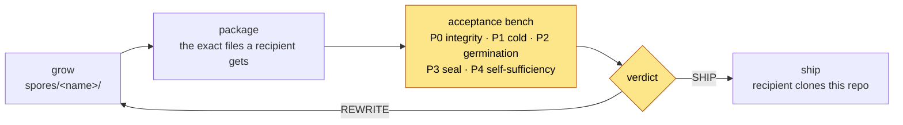

# Sporarium

**The nursery and acceptance bench for cosmon spores.**

A *spore* is a shareable, parameterizable template of an entire
[cosmon](https://github.com/noogram/cosmon) mission — a whole DAG of typed
tasks (a *polymer*), bundled with its crew constitution, its per-node recipes,
and a TLA+ seal. You drop in your problem, one command germinates the full
attack, and the run leaves a complete, auditable reasoning trace that you own.

Spores are **pure configuration** — no build step, no code. This repository is
where they are grown and, more importantly, where they are *proven*: every
spore is tested from the exact package a recipient receives, on the
[P0–P5 acceptance protocol](PROTOCOL.md), before it ships anywhere — including
a self-sufficiency pass in which a blank-context reader must be able to
understand and run the package from its own contents alone.

## Spores

| Spore | What it does | Status |
|---|---|---|
| [`spores/math-attack/`](spores/math-attack/) | Attack a hard mathematical conjecture with a proof/refutation pipeline: decomposition, parallel informal + formal (Lean 4) branches, adversarial review, fail-closed gates, and a machine-checked seal. Start with the 4-node `starter` profile; scale to the full 15 fixed node types (20 with fan-out types; 17 molecules at the default fan-out), 16-agent crew. | **Experimental** — germination-tested, not yet multi-day-run-tested |

Each spore's README is its quickstart: prerequisites, `cs spore validate`
(a dry run that germinates nothing), then `cs spore run`.

## Layout

- `spores/` — spore sources (the packages themselves). Each spore's README
  is its complete, self-contained guide.
- `PROTOCOL.md` — the acceptance protocol every spore passes before it ships.
- `bench/` — throwaway germination sandboxes (not tracked).

Frozen version archives and per-version acceptance reports are kept out of
this repository; shipped versions are tagged in git history (e.g. `math-attack-v3.2`).

## Honesty contract

A `seal: verified` line certifies the properties named in the TLA+ model
— termination, fail-closed gates, artifact flow — and nothing beyond them.
Each spore's README states exactly what was tested and what was not, and
claims are widened only when the corresponding test exists. Failures and
limitations are recorded, not hidden: a bench that only reports green is
not a bench.

---

Built by [Noogram](https://noogram.org) — open agent infrastructure and AI
tooling. Dual-licensed under MIT or Apache-2.0, at your option.
