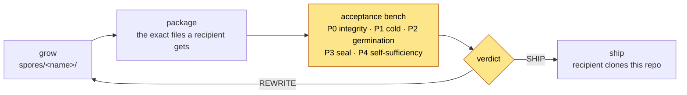

# Sporarium

**The nursery and acceptance bench for cosmon spores.**

A *spore* is a shareable, parameterizable template of an entire [cosmon](https://github.com/noogram/cosmon) mission — a whole DAG of typed tasks (a *polymer*), bundled with its crew constitution, its per-node recipes, and a TLA+ seal. You drop in your problem, one command germinates the full attack, and the run leaves a complete, auditable reasoning trace that you own.

Spores are **pure configuration** — no build step, no code. This repository is where they are grown and, more importantly, where they are *proven*: every spore is tested from the exact package a recipient receives, on the [P0–P5 acceptance protocol](PROTOCOL.md), before it ships anywhere — including a self-sufficiency pass in which a blank-context reader must be able to understand and run the package from its own contents alone.

```mermaid
flowchart LR
    grow["grow<br/>spores/&lt;name&gt;/"] --> pkg["package<br/>the exact files a recipient gets"]
    pkg --> bench["acceptance bench<br/>P0 integrity · P1 cold · P2 germination<br/>P3 seal · P4 self-sufficiency"]
    bench --> verdict{"verdict"}
    verdict -->|SHIP| ship["ship<br/>recipient clones this repo"]
    verdict -->|REWRITE| grow

    classDef gate fill:#fde68a,stroke:#b45309,color:#000;
    class bench,verdict gate
```

## Spores

| Spore | What it does | Status |
|---|---|---|
| [`spores/math-attack/`](spores/math-attack/) | Attack a hard mathematical conjecture with a proof/refutation pipeline: decomposition, parallel informal + formal (Lean 4) branches, adversarial review, fail-closed gates, and a machine-checked seal. Start with the 4-node `starter` profile; scale to the full 15 fixed node types (20 with fan-out types; 17 molecules at the default fan-out), 16-agent crew. | **Experimental** — germination-tested, not yet multi-day-run-tested |
| [`spores/math-attack-multi-model/`](spores/math-attack-multi-model/) | The two-provider variant: the problem is framed **twice, blind, on different providers**, each provider cross-examines the other's framing, and the merge labels every result `independent-convergence` / `A-only` / `B-only` / `disputed` without ever resolving a dispute by vote. The blinding is a **seal property checked by TLC**, not a rule in a prompt — wiring one branch downstream of the other is a violation, not a judgement call. | **Experimental** — sealed (6 properties, 2 negative tests), not yet run end-to-end |

Each spore's README is its quickstart: prerequisites, `cs spore validate` (a dry run that germinates nothing), then `cs spore run`.

## What a spore actually produced

[**Firoozbakht: a solo strong model against a clean-room fleet**](docs/reports/2026-07-25-firoozbakht-codex-cleanroom-comparison.en.md) *(also in [French](docs/reports/2026-07-25-firoozbakht-codex-cleanroom-comparison.md))* — `math-attack` was run twice on an open conjecture in number theory, and the result is compared against the same problem handed to a single strong model working alone for four minutes.

The honest finding is that the solo model recovered the mathematical core of the problem with remarkable density, and the fleet recovered it independently — then turned it into something the solo run could not: formal equivalences a kernel checks, reproducible computations, dead routes with obituaries, an audited bibliography, and standing objections. Neither settles the conjecture. The claim worth making is not that a fleet is smarter; it is that a fleet makes a good model's intuition **cumulative**.

The two published runs it audits: [`firoozbakht-cleanroom`](https://github.com/noogram-labs/firoozbakht-cleanroom) (independent, published exactly as generated) and [`firoozbakht`](https://github.com/noogram-labs/firoozbakht) (the first run, whose workspace was contaminated mid-flight — kept, documented, and it hosts the solo baseline).

## Layout

- `spores/` — spore sources (the packages themselves). Each spore's README is its complete, self-contained guide.
- `docs/reports/` — empirical studies of what the spores produced when run.
- `PROTOCOL.md` — the acceptance protocol every spore passes before it ships.
- `bench/` — throwaway germination sandboxes (not tracked).

Frozen version archives and per-version acceptance reports are kept out of this repository; shipped versions are tagged in git history (e.g. `math-attack-v3.2`).

## Honesty contract

A `seal: verified` line certifies the properties named in the TLA+ model — termination, fail-closed gates, artifact flow — and nothing beyond them. Each spore's README states exactly what was tested and what was not, and claims are widened only when the corresponding test exists. Failures and limitations are recorded, not hidden: a bench that only reports green is not a bench.

---

Built by [Noogram](https://noogram.org) — open agent infrastructure and AI tooling. Dual-licensed under MIT or Apache-2.0, at your option.
