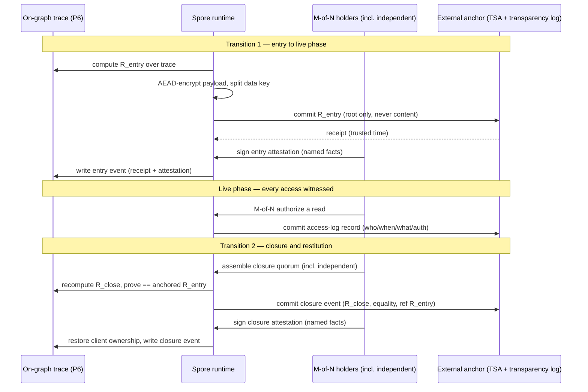

# Crisis-Cyber Spore — Custody-Escrow Design Specification (DESIGN)

**Status:** design specification. This is a *conception* document — schemas,
formats, sequences, invariants — for the live-phase custody escrow of the future
crisis-cyber spore. It is **not** an implementation: it ships no production code,
no `spore.toml`, no `spore.tla`, no `spore.cfg`. It is written to be precise
enough that an engineer can build the escrow from it and a jurist can contest it
clause by clause.

It is the fourth sibling in the crisis-cyber design corpus, downstream of three
registers it treats as settled and does not re-open:

- the **legal / regulatory / evidentiary register**
  (`crisis-spore-legal-regulatory-register.md`), especially §4 — the custody-
  continuity verdict and its five fixes — which this document renders concrete;
- the **seal-property register** (`crisis-spore-seal-property-register.md`),
  whose P6 (`TraceCompleteness`), P7 (`SoD-capability`), and §2.6 realized-model
  provenance record set the on-graph boundary the escrow must dock against;
- the **threat register** (`crisis-spore-threat-register.md`), whose row **B5**
  (exfiltration of the forensic trace on a compromised estate) is the risk this
  escrow answers, and whose *Custody-escrow resolution* section ratified the
  direction (LD1) this spec now details.

## What this document decides, and what it does not

It **decides** the escrow's construction: which split-key scheme, which M and N,
which external anchor, the exact envelope and receipt formats, and the two
custody transitions as ordered, fail-closed sequences. The operator already
ratified the *direction* — externally anchored, dual-controlled, integrity-
spanned (LD1). This spec turns that direction into buildable, contestable detail.

It does **not** re-open the decision to escrow, the spore topology, the node
perimeters, or the seal-property set. Where a choice here would change any of
those, it is flagged as a downstream question, not silently resolved.

## Confidentiality

Written for the **public repository**. No partner name, no nominative citation,
no commercial, fundraise, beachhead, or demo detail. Public facts named and
citable here: **RFC 3161** (trusted timestamps), **RFC 6962** (Certificate
Transparency, as the model for a transparency log), **Shamir's Secret Sharing**,
**NIST SP 800-86** (guide to integrating forensic techniques into incident
response), **NIST SP 800-57** (key-management recommendations, referenced
generically), **DORA** (Reg. (EU) 2022/2554), **NIS2** (Dir. (EU) 2022/2555),
**RGPD/GDPR** (Reg. (EU) 2016/679), and **ANSSI** incident-response guidance.
Written to be read by a recipient who has none of our agents and none of our
context.

---

## 0. The problem, the verdict, and the vocabulary

### 0.1 The problem, in one sentence

During an active compromise the client estate is the least trustworthy storage
that exists — the attacker may own it — yet the product thesis is that **the
trace belongs to the client**. Two virtues, *"the client owns the trace"* and
*"the attacker cannot read the trace,"* silently contradict during the live
phase. The reconciliation is an **out-of-band escrow for the duration of the
live phase, restored to the client at closure** — and a hostile judge has
established that this escrow, as first sketched (encryption only, self-attested
transition, key-holder off-graph), **breaks** chain-of-custody continuity.

### 0.2 The verdict this spec honors (already decided — LD1)

> The live-phase escrow **preserves** custody continuity **if and only if** it is
> anchored to the exterior, held under dual control, and covered end-to-end in
> **integrity** — not merely in confidentiality. As first sketched it **breaks**.

The five fixes that flip *break → preserve* are adopted and are not re-argued.
They are rendered concrete in §§2–7:

1. dual-control / split-key custody with an **independent** holder (§2);
2. carry the Merkle root across the boundary to an **external, non-rewritable
   anchor** (§3);
3. an **externally-attested** transition, not self-attested (§4);
4. **integrity separated from confidentiality** in the spec, as distinct named
   properties (§1);
5. **every live-phase access logged** to the external anchor (§5).

**The corollary that governs the whole document.** An unattested escrow
*fabricates* the very discontinuity it was meant to prevent. The two custody
transitions this spec adds are either the **strongest link** in the chain
(hashed, externally anchored, dual-attested) or the **break** — there is no
neutral middle. Every design choice below is measured against that corollary.

### 0.3 Vocabulary (so this document stands on its own)

- **forensic trace** — the append-only, hash-chained record the spore produces:
  step records, captured evidence manifests, reconstruction and investigation
  outputs. This is the object the escrow protects. Its on-graph continuity is
  certified by the seal's `TraceCompleteness` (P6).
- **live phase** — the window from the escrow's creation (at or near intake,
  §6.1) until incident closure. The estate is presumed compromised throughout.
- **closure** — the operator-declared end of the live phase, at which the trace
  is restored to full client ownership (§6.2).
- **escrow envelope** — the sealed container holding the encrypted trace plus its
  integrity metadata (§7.1). Confidentiality and integrity are *separate* fields
  of the envelope, never conflated.
- **Merkle root** — a single hash that commits to the entire trace: any change to
  any byte changes the root. Anchoring the *root* externally proves the trace's
  integrity without ever exposing its *content* — one anchors a root, never a
  payload.
- **external anchor** — an append-only, non-rewritable store, independent of both
  the client and the vendor, that records a commitment (a Merkle root, an access
  event) with a trusted time and returns a verifiable **receipt**. Options
  compared in §3.
- **independent holder** — a key-share custodian who is neither the client's
  incident-response (IR) team nor the tool's provider/operator. Its existence is
  what answers the "sole custody by an interested party" break-point (§2).
- **split-key / M-of-N** — the escrow decryption key is never held whole; it is
  split into N shares such that any M of them reconstruct or authorize use, and
  any M−1 cannot. Scheme chosen in §2.2.
- **attestation** — a signed statement by a party **outside the system under
  audit** that a specific fact is true (which root, which holders, what UTC time).
  Distinguished throughout from *self-attestation*, which is the break.

---

## 1. The property separation — confidentiality, integrity, continuity (fix #4)

The original defect was **a defect of vocabulary**: the escrow was specified only
in the language of confidentiality (*"encryption-at-rest, keys off the estate"*)
where integrity and continuity were the properties actually required. This
section fixes the vocabulary first, because every schema and sequence below
depends on keeping the three properties distinct. **No control listed under one
property may be cited as satisfying another.**

| Property | The question it answers | The control that provides it | The control that does NOT provide it |
|---|---|---|---|
| **Confidentiality** | Can the attacker (or anyone unauthorized) *read* the trace during the live phase? | Authenticated encryption of the trace payload (AEAD, e.g. AES-256-GCM or XChaCha20-Poly1305), with the key **split** and held off the compromised estate (§2). | Integrity: encryption says nothing about whether the plaintext was altered *before* encryption, or substituted under *re-encryption*. |
| **Integrity** | Were the bytes altered between escrow-in and escrow-out? | A Merkle root over the trace, committed to the on-disk record **and** to an external non-rewritable anchor before escrow-in, re-computed and proven equal at restoration (§3, §6). | Confidentiality: a root proves *unaltered*, not *unread*. Encryption is neither necessary nor sufficient for this. |
| **Authenticity** | *Who* committed each escrow event, with *what key*, at *what time*? | Digital signatures over each transition and access event by named key-holders, with the signing key identified; the transition externally attested (§4). | Both of the above: a valid signature over altered content, or over content someone else supplied, proves authorship of the *statement*, not correctness of the *bytes* — which is why authenticity rides *on top of* the Merkle root, not instead of it. |
| **Continuity** | Is there an *unbroken, documented* chain of custody across every transfer, including into and out of escrow? | Each transfer is a hashed, timestamped, authorized, externally-anchored event with equal root before/after; no unaccounted gap (§6, the sequences). | Any single one of the above alone: continuity is the *conjunction* — a confidential, integrity-covered, authentic escrow with an *undocumented transition* still breaks continuity. |

**The load-bearing sentence of this section:** *encryption gives confidentiality;
it never gives integrity, authenticity, or continuity — and the escrow needs all
four.* AEAD's own authentication tag detects tampering of the *ciphertext at
rest*, which is a genuine integrity property of the stored blob; it does **not**
reach the plaintext-before-encryption or the substitution-under-re-encryption
attacks, which is exactly why the external Merkle-root anchor (§3) is a separate,
non-negotiable control and not a duplicate of the AEAD tag.

---

## 2. Fix #1 — Dual-control / split-key custody with an independent holder

### 2.1 The break-point being closed

**Break-point 1 (hostile-judge seat):** during the unobserved live window, if the
vendor or the client's own IR team holds *both* the escrow and its keys, then the
party with the strongest interest in the incident's outcome had **sole,
off-estate, unwitnessed control** of the record during the contested period —
"there is no way to exclude the hypothesis that the record was curated before it
was restored." A textbook custody break. The escrow key-holder must not be a
single interested party.

### 2.2 The scheme: threshold split, M-of-N, with the independence constraint on N

Three candidate schemes were on the table. The recommendation and the rejections:

| Scheme | What it is | Verdict |
|---|---|---|
| **Shamir's Secret Sharing (SSS)** | The decryption key is split into N shares over a finite field; any M reconstruct it, any M−1 reveal nothing. Pure secret-sharing, no signing. | **Rejected as the primary mechanism, on one specific ground:** reconstruction re-assembles the *whole key* in one place (whoever runs the reconstruction), re-creating a momentary single point of custody and leaving **no cryptographic record of who authorized the decryption**. Usable only if paired with a separate signed authorization + anchored access log (§5). Retained as a *fallback* keying primitive where threshold signing is unavailable (§2.5). |
| **Threshold multi-signature (t-of-n)** | Each holder holds an independent key; M signatures authorize an action (here: release of the decryption capability) without ever reconstructing a single secret. Each authorization is a **verifiable, attributable signature**. | **RECOMMENDED.** It never re-assembles a whole key, and every use of the escrow is a set of M signatures naming *who* authorized it — which is exactly the authenticity and access-log evidence the custody chain needs. The authorization *is* the attestation. |
| **Plain M-of-N multi-signature (non-threshold)** | M distinct signatures over the release, verified independently (no threshold cryptography). | **Acceptable fallback** where threshold-signature tooling is unavailable to the recipient. Slightly larger authorization artifacts; identical custody properties. Named so a bare-handed recipient is not blocked. |

**Recommendation:** the escrow-release capability is guarded by an **M-of-N
threshold signature** (recommended) or plain M-of-N multi-signature (fallback);
the payload itself is AEAD-encrypted under a data key, and the data key is
released only on a valid M-of-N authorization. Where the recipient can run
neither, **Shamir split of the data key** is the floor, mandatorily paired with a
signed, anchored authorization record so the "who authorized" evidence is not
lost.

### 2.3 Choosing M and N, and who the holders plausibly are

The values are a *recipient-configurable parameter with a mandated floor*, not a
fixed constant, because the plausible holders differ per recipient. The floor:

> **N ≥ 3, M ≥ 2, and at least one of the N holders MUST be independent of both
> the client IR team and the tool provider/operator.**

- **N = 3, M = 2** is the recommended default. It tolerates one holder being
  unreachable during the crisis (§2.4) while still requiring two independent
  parties to open the escrow — no single interested party can decrypt alone.
- **M = 2 of N = 3** with the three roles:
  1. **Client IR / CISO** — an interested party, legitimately present.
  2. **Tool provider / operator** — the other interested party.
  3. **Independent holder** — neither of the above. Plausible candidates, named
     as *categories* (no partner names): the client's **external legal counsel**
     (already bound by professional duty and privilege), a **notary or
     bailiff/huissier** (in jurisdictions where they provide digital-custody
     services), a **contracted independent forensic escrow provider**, or a
     **qualified trust service provider** under the relevant e-signature/trust
     framework. The independent holder is the party whose signature converts
     *"the interested parties opened their own box"* into *"an outsider witnessed
     the opening."*

**Why at least one independent holder and not merely M ≥ 2.** Two interested
parties colluding (IR + vendor) is precisely the hypothesis a hostile judge
raises. Requiring the M-of-N set to be *satisfiable only with the independent
holder's participation for the highest-consequence operations* (see §2.6) is what
forecloses that hypothesis. At the recommended 2-of-3, the design does **not**
force the independent holder into *every* routine access (that would fail §2.4's
availability test); instead it forces the independent holder into the two custody
*transitions* (entry and closure, §6) and into any *restoration/decrypt-to-
plaintext* of the full trace, while allowing IR + vendor to jointly perform
in-crisis operational reads that are themselves logged to the anchor (§5).

### 2.4 The unreachable-holder problem — a box that cannot be opened under pressure is also a failure

A split-key escrow that **cannot be reopened under crisis pressure** is a failure
as grave as one that can be reopened by a single party. The design must survive a
holder being unreachable at 3 a.m. during an active incident.

- **The M < N margin is the primary answer.** At 2-of-3, any single holder may be
  unreachable and the escrow still opens with the other two — *provided* the
  reachable two include the independent holder for a transition/restoration, or
  are IR + vendor for a logged operational read.
- **The failure case to name honestly:** if the specific quorum required for a
  given operation cannot be assembled (e.g. a transition needs the independent
  holder and *only* the independent holder is unreachable), the operation
  **fails closed** and the event is logged to the anchor as an *unavailable-
  quorum* record (§5). It does not silently downgrade to a smaller quorum.
- **Standing pre-provision, not crisis-time improvisation.** Because a crisis is
  the worst time to recruit a custodian, holders and their shares/keys MUST be
  provisioned **before germination against a live estate** — this is part of the
  `drill-only` → live promotion floor (see the threat register's Decision 3). A
  spore germinated against a live crisis without a pre-provisioned N-holder set
  refuses at the transition rather than inventing a custodian under pressure.
- **A named, pre-anchored break-glass path** MAY be provisioned: an additional
  emergency share held by a fourth, independent, high-assurance party (raising N),
  usable only via a distinct quorum that is *itself* recorded to the anchor. The
  break-glass path is optional, pre-declared, and never a silent single-party
  override — if it exists, its very existence and its quorum are anchored at
  provisioning time so its later use cannot be denied or forged.

### 2.5 Recommended primitive summary

- **Payload:** AEAD (AES-256-GCM or XChaCha20-Poly1305) under a per-incident data
  key.
- **Data-key custody:** released only under **M-of-N threshold signature**
  (recommended) / plain M-of-N multi-sig (fallback) / Shamir split + signed
  anchored authorization (floor).
- **Floor:** N ≥ 3, M ≥ 2, ≥ 1 independent holder; default 2-of-3.
- **Key hygiene** follows generic NIST SP 800-57 recommendations; specific
  algorithms and curve choices are an implementation decision left to the builder
  and are out of scope here (§9).

### 2.6 Which operations require which quorum (capability matrix)

| Operation | Required quorum | Must include independent holder? | Anchored? |
|---|---|---|---|
| **Entry-to-live-phase transition** (escrow creation) | M-of-N | **Yes** | Yes (§6.1) |
| **In-crisis operational read** (decrypt a subset for live analysis by our own agents/IR) | M-of-N | No (IR + vendor permitted) | **Yes — every read** (§5) |
| **Closure / restoration transition** (full decrypt, restore to client) | M-of-N | **Yes** | Yes (§6.2) |
| **Break-glass** (if provisioned) | distinct pre-declared quorum | per provisioning | Yes, incl. existence at provisioning |

---

## 3. Fix #2/#3 — The external, non-rewritable anchor carrying the Merkle root

### 3.1 The break-point being closed

**Break-points 2 and 3 (hostile-judge seat):** the certified hash-chain
(`TraceCompleteness`, P6) is blind to anything that is not a typed edge, and the
escrow is by definition an *out-of-band channel*. So the certified continuity
**stops at the escrow door**, resumes after restoration, and nothing carries the
hash-chain head across the boundary — "certified chain, uncertified void,
certified chain." And the transition, as sketched, attests *itself*: it is
authored by the same runtime whose integrity is in question — hearsay of the
system. The fix bridges the void with a commitment carried to a store **outside
the system under audit**.

### 3.2 What crosses the boundary: a root, never a payload

Before the trace enters escrow, the spore computes a **Merkle root** over the
entire trace (every step record, every captured-evidence manifest, every
reconstruction output — the leaves are the per-node hashes the on-graph chain
already produces). That single root is committed to:

- **(a) the on-disk certified trace** (the on-graph side — already covered by P6);
  and
- **(b) an external non-rewritable anchor** (the off-graph side — the new
  control).

At restoration, the root is re-computed over the restored trace and **proven
equal** to the anchored value. This converts *"trust the escrow"* into *"verify
the escrow"* without ever placing trace content outside the estate:

> **One anchors a ROOT, never CONTENT.** The anchor sees a hash and a time. It
> never sees a single byte of the incident. This is what makes external anchoring
> compatible with the confidentiality requirement of §1 and with RGPD data-
> minimization — the most sensitive artifact in the building never leaves it; only
> a number that commits to it does.

### 3.3 The options, compared on the axes that matter here

The axes that decide this choice are, in order of weight for a live crisis:
**(i)** independence from *both* parties; **(ii)** non-rewritability; **(iii)**
availability *during* a crisis; **(iv)** confidentiality of what is anchored
(a root, so this is mostly satisfied by construction, but metadata leakage
differs); **(v)** cost.

| Option | (i) Independence | (ii) Non-rewritable | (iii) Crisis availability | (iv) Confidentiality | (v) Cost | Verdict |
|---|---|---|---|---|---|---|
| **RFC 3161 trusted timestamp (TSA)** | High — a third-party TSA is independent of both parties | High — TSA counter-signs a hash + time; cannot be back-dated or altered without detecting the TSA key | **High** — a single signed HTTP round-trip; degrades gracefully; can be pre-contracted with multiple TSAs | High — TSA receives only the hash | Low | **RECOMMENDED as the primary anchor.** Mature (RFC 3161), widely available, cheap, fast, sees only a hash, and the standard trusted-timestamp instrument courts already accept. |
| **Transparency log (Certificate-Transparency-style, RFC 6962 model)** | High — an independent log operator; strongest when multiple independent logs are used | Very high — append-only Merkle tree with publicly verifiable consistency + inclusion proofs; the gold standard for *"cannot be silently rewritten"* | Medium — depends on a running log service and its availability during the crisis window | High — anchors a root; but log *inclusion* is publicly observable, which can leak *"an incident is in progress"* timing metadata | Medium | **RECOMMENDED as a complementary second anchor** for the two custody *transitions* (the highest-consequence events), where publicly-verifiable inclusion/consistency proofs add the most. Not required for every routine access. |
| **WORM store (write-once-read-many)** | **Medium — weaker on independence.** A WORM store operated by the client or vendor is not independent of them; independence must come from a *third-party-operated* WORM. | High — hardware/policy-enforced immutability | High | High | Low–Medium | **Acceptable fallback**, but only when third-party-operated (else it fails axis (i), the very break-point being closed). A client-run WORM is not an answer to "sole custody by an interested party." |
| **Public blockchain** | Very high — no single operator | Very high — practical immutability | **Low–Medium — the weak axis.** Confirmation latency and fee volatility are hostile to a 4-hour clock; a congested chain can delay a commitment past the window. | High for content (a root), **but** on-chain commitments are permanent and globally visible — timing/existence metadata leaks irreversibly and cannot be walked back even after the incident. | Variable/volatile | **NOT recommended.** The one thing it adds over a TSA + transparency log — operator-less immutability — is not worth the crisis-time latency, fee volatility, and permanent, un-retractable public metadata footprint. Explicitly set aside. |

**Recommendation (the anchor stack):**

1. **Primary, every commitment:** an **RFC 3161 trusted timestamp** from a
   third-party TSA. Fast, cheap, independent, sees only a hash.
2. **Complementary, for the two custody transitions:** additionally record the
   transition root to an **independent transparency log** (RFC 6962-style) for
   publicly-verifiable inclusion/consistency proofs at the highest-consequence
   moments.
3. **Resilience:** pre-contract **≥ 2 independent TSAs** so a single TSA outage
   during the crisis does not block a transition (this feeds the degraded-mode
   decision, §8).
4. **Rejected:** public blockchain (latency, fee volatility, permanent metadata
   leak); client/vendor-operated WORM (fails the independence axis that is the
   whole point).

---

## 4. Fix #3 (transition attestation) — externally attested, not self-attested

### 4.1 The break-point being closed

**Break-point 2:** a self-attested transition is *hearsay of the system* — the
machine's own diary, authored by the runtime whose integrity is contested. The
fix binds each transition to something **outside the system under audit**.

### 4.2 By whom, in what form, and what it covers

The transition attestation is a **signed statement by parties outside the runtime
under audit**, anchored externally. Concretely:

- **By whom.** The **M-of-N key-holders** who authorize the transition, at least
  one of them the **independent holder** (§2.3). The independent holder's
  signature is what makes the attestation *external* — the runtime is not a
  signer; the humans (or their trust-service delegates) holding keys outside the
  DAG are. In addition, the **external anchor's receipt** (the TSA counter-
  signature and/or the transparency-log inclusion proof, §3) is a second,
  operator-independent witness of the transition's time and content.
- **In what form.** A **transition attestation record** (schema in §7.3): a
  signed document naming the specific facts. Signatures are verifiable against
  the holders' pre-provisioned public keys; the anchor receipt is verifiable
  against the anchor's published key/log.
- **What it covers, exactly** (the specific facts, not a global "approve"):
  1. **which Merkle root** is being committed (the trace state at that instant);
  2. **which key-holders** authorized the transition (identities + key ids);
  3. **what UTC time** — the anchor's trusted time, not a runtime clock;
  4. **which transition** (entry-to-live | closure/restoration | break-glass);
  5. **the previous anchored root** (for closure: proving equality to entry;
     linking the two transitions into one chain, §6.3).

This mirrors the fact-attesting countersign discipline the legal register adopted
for irreversible actions (its B6 / P9 family): the signer attests to **named
facts**, not to a blanket approval, and the attestation is only meaningful because
one signer sits outside the audited system.

---

## 5. Fix #5 — Logging every live-phase access to the anchor

### 5.1 The break-point being closed

**Break-point 5** and the *unobserved window*: whoever can decrypt during the live
phase has, off-graph, exactly the decrypt-alter-re-encrypt-re-hash capability the
on-graph `SoD-capability` (P7) forbids. The answer is to make the window
**observed** — every access witnessed by a store the interested party cannot
alter.

### 5.2 What is logged, and about whom (including our own agents)

Every live-phase access to the escrow — **every** decryption, of any subset, by
**any** actor, *including our own agents and the IR team* — emits an **access-log
record** (schema §7.4) that is:

- **committed to the external anchor** (RFC 3161 timestamp on the record's hash),
  so the log of accesses is itself non-rewritable and independently timed; and
- **captured in the forensic trace** where the trace is on-graph.

The record answers **who read, when, what, and under whose authorization**:

- **who** — the actor identity (a specific agent id + realized-model provenance
  per the seal register §2.6 if an agent; a named human + key id if a person);
- **when** — the anchor's trusted time;
- **what** — the identifier(s) of the trace subset decrypted (by manifest id /
  Merkle path), **never the plaintext**;
- **under whose authorization** — the M-of-N signers who released the data key for
  this read (§2.6).

**Our own agents are not exempt.** A read by a spore worker during live analysis
is logged identically to a read by a human. This is deliberate: the *"was the
record curated before restoration"* hypothesis is refuted only if *all* accesses
— ours included — are on an un-rewritable ledger. An access log that excludes the
tool's own reads would let the exact curation it exists to disprove happen
un-witnessed.

### 5.3 Access log ≠ integrity anchor

The access log records *that a read happened*; the Merkle-root anchor records
*that the content did not change*. They are separate commitments to the same
anchor and neither substitutes for the other (§1). A read is not a write — but on
a compromised estate the design cannot assume a "read-only decrypt" stayed
read-only, so pairing every logged access with a re-verification of the current
root against the anchored root (on the next transition) is what closes the loop:
a covert alter-after-read is caught at restoration because the roots diverge.

---

## 6. The two custody transitions, as sequences

The transitions are **sequences, not settings**. For each: what is hashed, what
is attested, what is anchored, in what order, and **what must fail closed if a
step is missing.** The governing corollary (§0.2) applies with full force here:
these two sequences are the strongest link or the break.

### 6.1 Transition 1 — entry into the live phase (escrow creation)

Triggered at or near `intake`, once the evidence-preservation gate has sealed the
initial custody (so the escrow protects an already-integrity-fixed object; see the
capture→intake articulation in §6.4).

**Ordered steps:**

1. **Compute the entry Merkle root** `R_entry` over the current trace state
   (leaves = the on-graph per-node hashes). *Hashed:* the whole trace, into one
   root.
2. **Encrypt the payload** under a fresh per-incident data key (AEAD). *This is
   confidentiality (§1) — and only confidentiality.*
3. **Split/guard the data key** under the M-of-N scheme (§2), with holders
   pre-provisioned; the entry quorum **must include the independent holder**
   (§2.3, §2.6).
4. **Anchor `R_entry` externally** — RFC 3161 timestamp (primary) + transparency-
   log entry (complementary, this is a transition). *Anchored:* the root + trusted
   time. Obtain and store the **anchor receipt(s)**.
5. **Produce the entry transition attestation** (§4, §7.3): the M-of-N holders
   sign the named facts (which root = `R_entry`, which holders, what UTC time from
   the anchor, transition = entry). *Attested:* by parties outside the runtime.
6. **Write the entry event into the forensic trace** as a first-class step record
   (so P6 covers the on-graph side of the boundary) — carrying the anchor receipt
   and the attestation.

**What must fail closed (no neutral middle):**

- If **`R_entry` cannot be anchored** externally → the transition does **not**
  silently proceed with a self-attested root. It enters **degraded mode** (§8)
  and the honest gap is recorded; the spore does not pretend the void was bridged.
- If the **entry quorum cannot be assembled** (no independent holder reachable) →
  fail closed, log an *unavailable-quorum* record (§5.2); do **not** downgrade the
  quorum.
- If **encryption or key-split fails** → no escrow is created; the trace is not
  moved off-estate under a broken confidentiality control. (This is the one case
  where staying on-estate is the safer failure — but it must be recorded as such,
  not hidden.)
- If the **attestation is absent or incomplete** → the escrow is not treated as
  live-custody-valid; an unattested escrow *manufactures* discontinuity, so an
  incomplete step 5 is a failed transition, not a soft warning.

### 6.2 Transition 2 — closure with restitution to the client

Triggered at operator-declared closure of the live phase.

**Ordered steps:**

1. **Assemble the closure quorum** — M-of-N, **including the independent holder**
   (§2.6). Release the data key.
2. **Decrypt the payload** to plaintext.
3. **Re-compute the current Merkle root** `R_close` over the restored trace.
4. **Prove equality** `R_close == R_entry` **against the externally anchored
   `R_entry`** (not merely against an on-disk copy — the on-disk copy is inside
   the system under audit; the external anchor is the trusted witness). Also
   verify that every live-phase access-log record (§5) is present and anchored.
5. **Anchor the closure event** externally — timestamp + transparency-log entry —
   committing `R_close`, the equality result, and a reference to `R_entry`'s
   anchor (linking the two transitions, §6.3).
6. **Produce the closure transition attestation** (§4, §7.3): holders sign the
   named facts (which root = `R_close`, equality-to-`R_entry` = proven, which
   holders, what UTC time, transition = closure, previous anchored root).
7. **Restore full client ownership** — the trace, now with an unbroken,
   externally-witnessed custody record spanning the escrow, is returned to the
   client's vault; the data key and shares are destroyed per key-hygiene
   (out-of-scope specifics, §9).
8. **Write the closure event into the forensic trace.**

**What must fail closed:**

- If **`R_close ≠ R_entry`** → the escrow is declared **broken for that trace**:
  restoration proceeds (the client gets their data) but the bundle is flagged
  **integrity-failed**, the divergence is anchored and attested, and no conclusion
  resting on the escrowed trace may be presented as integrity-continuous. This is
  the escrow doing its job — detecting the alteration it exists to detect — not a
  silent pass.
- If **any access-log record is missing or unanchored** → the *unobserved-window*
  objection is not answered for that gap; the bundle is flagged with a named,
  disclosed continuity gap rather than presented as fully witnessed.
- If the **closure quorum cannot be assembled** → fail closed; the trace is not
  left permanently unrestorable (that is the §2.4 failure), so the break-glass
  path (if provisioned) is the sanctioned, anchored route — never an ad-hoc
  single-party decrypt.
- If the **closure cannot be anchored/attested** → degraded mode (§8): the
  restoration is honestly recorded as having a closure-side anchoring gap.

### 6.3 The two transitions form one chain

Closure's attestation references entry's anchored root (§4.2 item 5; §6.2 step 5).
The result is a **three-segment chain that is continuous end-to-end**: certified
on-graph trace (P6) → externally-anchored, dual-attested entry → [live phase,
every access anchored] → externally-anchored, dual-attested closure proving
equality → certified on-graph trace again. The "uncertified void" the hostile
judge identified is filled by external witnesses at both doors and at every access
in between. **This is the concrete form of *strongest link, or break*.**



### 6.4 The capture→intake gap (dewey) — integrity fixed at capture, not at intake

The seal is structurally blind to everything *before* intake: `TraceCompleteness`
hashes at the preservation gate, which is *inside* the spore and *after* intake.
Anything that happened to an artifact between real-world **capture** and **intake**
is an **unsealed segment of custody**, and a hash first computed at intake fixes a
*state*, not a *chain*.

The escrow does **not** close this gap — it sits *downstream* of intake — and it
must not be presented as if it did. What the escrow spec requires of the layer
upstream of it, so the two dock cleanly:

- **Integrity MUST be fixed at capture.** Each input carries a hash computed *at
  or near the moment of collection by the collecting instrument* (per NIST SP
  800-86 acquisition discipline: image first, write-block, hash at capture), and
  the preservation gate **verifies capture-hash equals ingest-hash**. Only then is
  the artifact admitted to the trace the escrow will later protect.
- **The escrow's entry root `R_entry` therefore commits to capture-fixed hashes,
  not intake-fixed states.** Because the leaves of the Merkle tree are the
  per-input hashes that were *verified equal to their capture-time hashes* at the
  gate, anchoring `R_entry` externally extends the externally-witnessed integrity
  chain as far back as capture — but only *as far as the capture-time hashing
  actually reached*. Where an input has no capture-time hash (it was first hashed
  at intake), that input's pre-intake segment is an honestly-disclosed gap the
  escrow cannot retroactively seal.
- **Honest boundary statement for the bundle:** *the escrow provides externally-
  witnessed integrity and continuity from `R_entry` onward; the integrity of each
  input before it entered the trace is a separate, upstream provenance claim
  (capture-time hashing) that the escrow relies on but does not itself establish.*
  Necessary is not rounded to sufficient.

---

## 7. Schemas and formats

Illustrative schemas (field names + semantics). Concrete serialization (JSON,
CBOR, protobuf), exact crypto suites, and wire encodings are implementation
choices (§9). All hashes are over canonicalized bytes; algorithm agility is
assumed (each hash/signature field carries its algorithm id).

### 7.1 Escrow envelope

```
EscrowEnvelope {
  envelope_id            : string          # unique per incident
  spore_run_id           : string          # binds to the germination
  created_at_anchor_time : timestamp        # from the anchor, not the runtime
  confidentiality : {
    aead_alg     : enum   # e.g. AES-256-GCM | XChaCha20-Poly1305
    ciphertext   : bytes  # the encrypted trace payload
    nonce        : bytes
    aad          : bytes  # authenticated associated data (binds envelope_id, root)
  }
  integrity : {                            # SEPARATE from confidentiality (§1)
    merkle_root_alg : enum
    entry_root      : hash   # R_entry, also anchored externally
    leaf_scheme     : string # how leaves map to per-node/per-input hashes
  }
  key_custody : {
    scheme       : enum   # threshold-multisig | multisig | shamir+authlog
    M            : int
    N            : int
    holders      : [ HolderRef ]   # ids + public keys/verification material
    independent_holder_ids : [ string ]  # MUST be non-empty (§2.3)
  }
  anchor_receipts : [ AnchorReceipt ]      # entry-time receipts (§7.2)
  entry_attestation : TransitionAttestation # (§7.3)
}

HolderRef {
  holder_id    : string
  role         : enum   # client_ir | provider | independent | break_glass
  pubkey       : bytes
  key_alg      : enum
}
```

### 7.2 Anchor receipt

```
AnchorReceipt {
  anchor_type   : enum    # rfc3161_tsa | transparency_log | worm
  anchor_id     : string  # which TSA / which log
  committed_hash: hash    # the root or access-record hash (NEVER content)
  anchor_time   : timestamp   # trusted time from the anchor
  proof         : bytes   # TSA token | log inclusion+consistency proof | WORM ref
  verifiable_against : string  # anchor public key / log identity
}
```

### 7.3 Transition attestation

```
TransitionAttestation {
  transition_type : enum   # entry | closure | break_glass
  committed_root  : hash   # R_entry (entry) or R_close (closure)
  previous_root   : hash?  # closure references the anchored R_entry (§6.3)
  equality_proven : bool?  # closure only: R_close == anchored R_entry
  anchor_receipts : [ AnchorReceipt ]
  signers : [ {
    holder_id : string
    role      : enum
    signature : bytes      # over the named facts below
    key_id    : string
  } ]
  attested_facts : {       # the SPECIFIC facts, not a global approve (§4.2)
    root        : hash
    holder_ids  : [ string ]
    utc_time    : timestamp   # from the anchor
    transition  : enum
  }
  independent_signer_present : bool   # MUST be true for entry/closure (§2.6)
}
```

### 7.4 Live-phase access-log record

```
AccessLogRecord {
  access_id     : string
  envelope_id   : string
  actor : {
    kind        : enum   # agent | human
    actor_id    : string
    realized_model_provenance : ModelProvRef?  # if agent (seal register §2.6)
    key_id      : string?                       # if human signer
  }
  what_decrypted : [ string ]   # manifest ids / Merkle paths — NOT plaintext
  authorized_by  : [ string ]   # the M-of-N signer holder_ids for this read
  anchor_receipt : AnchorReceipt   # every access anchored (§5.2)
  access_time    : timestamp        # trusted time
  outcome        : enum   # granted | unavailable_quorum | denied
}
```

---

## 8. Degraded mode — when the external anchor is unreachable during the crisis

**The decision, taken here and not deferred:**

> If the external anchor is unreachable at a transition, the spore **fails closed
> at the two custody transitions** (entry, closure) and **continues-with-honest-
> record for in-crisis operational reads**, never silently proceeding as if the
> void were bridged.

Rationale, and the recipient-facing consequence:

- **At the two transitions, anchoring is load-bearing** — it is the whole fix for
  break-points 2 and 3. A transition whose root was never externally witnessed is
  *exactly* the self-attested, unbridged void the design exists to prevent.
  Proceeding would re-introduce the break under the cover of a green process.
  Therefore: **≥ 2 independent TSAs are pre-contracted** (§3) so a single anchor
  outage does not block a transition; only if *all* configured anchors are
  unreachable does the transition fail closed. A failed-closed entry means the
  trace stays on-estate under its on-graph seal until an anchor is reachable —
  worse for confidentiality (B5 risk), but it does not fabricate a false custody
  bridge. The recipient is told: *"the escrow could not be externally anchored;
  the trace remained on the estate; here is the window during which it did."*
- **For in-crisis operational reads, refusing to continue would be worse** — it
  would halt live incident analysis during an active breach. So a read may proceed
  with the access-log record written to the trace and **queued for anchoring**,
  with an explicit `anchor_pending` flag; the queued records are anchored as soon
  as an anchor is reachable, and the closure transition (§6.2 step 4) verifies
  every access record is *eventually* anchored. The gap is **named, timed, and
  disclosed**, never hidden.
- **What the recipient must know, stated in the README, out loud:** which events
  are hard-fail-closed (transitions) versus continue-with-honest-record
  (operational reads); that an anchor outage during the live phase produces a
  *disclosed continuity gap* the bundle carries as a named limitation; and that a
  bundle with an un-anchored transition is **not** an integrity-continuous bundle
  and must not be presented as one. An honest gap is livable; a hidden one is the
  discontinuity the escrow was built to prevent.

---

## 9. Out of scope, and why

- **Concrete cryptographic suite selection** (which curve, which AEAD, which
  threshold-signature construction, KDF choices). This spec fixes the *properties*
  and the *scheme class*; the exact primitives are an implementation decision
  bounded by generic NIST SP 800-57 key-management guidance and the recipient's
  own crypto policy. Fixing them here would date the document and constrain
  recipients with different compliance baselines.
- **Key lifecycle mechanics** (generation ceremony, rotation, destruction
  procedures, HSM vs software custody). Referenced generically; the builder
  follows their key-management standard. In scope here only insofar as §2.4
  requires pre-provisioning before live germination and §6.2 step 7 requires
  destruction at closure.
- **The seal / TLA+ model of the escrow.** This is a conception document, not a
  seal. Whether and how the transition sequences are expressed as TLA+ invariants
  is the seal-authoring molecule's work; note that the escrow lives *out-of-band*
  and the seal is structurally blind to it (that blindness is the reason the
  external anchor exists), so most of this spec is enforced by anchoring and
  attestation, not by TLC. The one on-graph dock is that the entry and closure
  **events** are first-class step records (§6.1 step 6, §6.2 step 8) so P6 covers
  the on-graph side of each door.
- **Choice of the independent holder for a specific recipient.** Named only as
  categories (§2.3); the actual party is a recipient/legal decision, not a
  spore-design decision, and naming one would breach the public-repo
  confidentiality constraint.
- **The upstream capture-time hashing layer itself** (§6.4). The escrow *requires*
  it and *docks against* it, but building the collection instruments that hash at
  capture is upstream forensic tooling, not the escrow.
- **Regulatory notice content, admissibility scoring, and the reportability
  decision.** Governed by the legal register (§§1–3, 5) and out of this document's
  lane; the escrow supplies the *custody* input those depend on, nothing more.
- **Wall-clock timeliness of any transition.** Whether a transition happened
  "fast enough" is a watchdog/operational concern, exactly as the seal register
  holds for `NoSilentClockMiss`; the anchor supplies a *trusted time* for each
  event, but enforcing a deadline against it is outside this spec.

---

## 10. Invariants (the contestable core)

A jurist or engineer should be able to challenge the escrow by testing these. Each
is stated so its violation is a *specific, observable* defect.

- **INV-1 (independence).** No escrow transition (entry, closure) is valid unless
  its authorizing quorum includes at least one holder independent of both the
  client IR team and the provider. *Violation:* a transition attestation whose
  `independent_signer_present` is false. Closes break-point 1.
- **INV-2 (external witness at every door).** Every transition commits its root to
  an external, non-rewritable anchor and carries the receipt. *Violation:* a
  transition with no `AnchorReceipt`, or a receipt from a client/vendor-operated
  store. Closes break-points 2 and 3.
- **INV-3 (root, never content).** No content — no plaintext trace byte — ever
  crosses to the anchor; only a Merkle root or a record hash. *Violation:* any
  anchor commitment whose `committed_hash` is derived from anything but a root or
  a metadata-record hash. Preserves confidentiality and RGPD minimization.
- **INV-4 (integrity ≠ confidentiality).** Encryption is never cited as the
  integrity or continuity control; the Merkle-root anchor is a separate, present
  control. *Violation:* an envelope with confidentiality fields but no anchored
  `entry_root`. Closes break-point 4.
- **INV-5 (equality proven at closure).** Restoration proves `R_close == R_entry`
  against the *externally anchored* `R_entry`, not merely an on-disk copy.
  *Violation:* a closure attestation with `equality_proven` absent or checked only
  against local state.
- **INV-6 (every live-phase access anchored, ours included).** Every decryption
  during the live phase emits an anchored access-log record, including reads by
  the spore's own agents. *Violation:* a decrypt event with no anchored
  `AccessLogRecord`. Closes break-point 5 / the unobserved window.
- **INV-7 (off-graph SoD).** No single actor can, alone, complete a
  decrypt-alter-re-encrypt-re-hash cycle: decryption requires M-of-N, alteration
  is caught by INV-5, and every access is witnessed by INV-6. *Violation:* any
  path to plaintext requiring fewer than M authorizations. This is P7's
  separation-of-capability extended off-graph (see §11).
- **INV-8 (fail-closed transitions).** A transition with a missing hash, absent
  anchor, incomplete attestation, or unassemblable quorum does not proceed as
  valid custody; it fails closed or enters disclosed degraded mode. *Violation:* a
  transition marked valid with any of steps §6.1/§6.2 skipped. Enforces the
  *strongest-link-or-break* corollary.
- **INV-9 (no silent phase change).** Both transitions are first-class recorded
  events (in the trace and at the anchor), never silent settings. *Violation:* a
  live→closed phase change with no transition record. A declared escrow
  strengthens the record; a discovered one destroys it.
- **INV-10 (honest degraded disclosure).** Any anchoring or attestation gap is
  named, timed, and carried in the bundle as a disclosed limitation. *Violation:*
  a bundle presented as integrity-continuous while carrying an un-anchored
  transition or an unanchored access record.

---

## 11. How key custody reconciles with P7 (separation of capabilities) — fix #5's structural answer

**Break-point 5 (hostile-judge seat):** the escrow key-holder lives *outside* the
modeled DAG, so `SoD-capability` (P7) — which forbids one *modeled actor* from
holding evidence-write + production-write — does not reach them. Whoever holds the
key during the live phase has unwitnessed decrypt-alter-re-encrypt-re-hash
capability: exactly the concentration of capability the on-graph seal forbids,
re-opened off-graph.

The reconciliation, stated plainly:

> **The key-holder is legitimately *outside* the DAG — the escrow is out-of-band
> by design, and that is the point — but the separation-of-capabilities property
> is *extended* off-graph by non-seal controls, not abandoned.** P7 forbids
> capability concentration *within* the modeled actors; INV-1, INV-6, and INV-7
> forbid the *same* concentration *among the key-holders*, enforced by dual
> control + anchored access + proven equality instead of by TLC.

Concretely, the off-graph analogue of each on-graph guarantee:

| On-graph (seal, P7) | Off-graph (this spec) | Enforced by |
|---|---|---|
| No one modeled actor holds two write capabilities | No one key-holder can decrypt alone | M-of-N + independent holder (INV-1, INV-7) |
| Every capability use is a trace step (P6) | Every decrypt is an anchored access record | INV-6 |
| Alteration breaks the on-graph hash chain (A4) | Alteration breaks equality to the anchored root | INV-5 |
| The seal proves it before germination | The anchor + attestations prove it during and after | §§3–6 |

**Why it is legitimately excluded from the seal rather than forced into it.**
Forcing the key-holder into the modeled DAG would mean modeling the escrow as an
on-graph typed edge — but then it is no longer *out-of-band*, and it loses the
one property (independence from the compromised estate and from the runtime under
audit) that makes it a custody control at all. The seal is *structurally blind to
out-of-band channels by design* (seal register §3), and the escrow is deliberately
such a channel. So the honest posture is: the seal does **not** and *should not*
reach the key-holder; the equivalent guarantee is delivered by the external,
independent controls above, and the bundle says so out loud rather than implying a
green seal covered the escrow. Selling the escrow as *seal-covered* would be the
same overclaim the whole corpus exists to refuse.

---

## 12. Register status and downstream

**What this spec renders concrete** (from the legal register §4 / threat register
B5, LD1-ratified): the five fixes as buildable detail — the M-of-N scheme and its
floor (§2), the anchor stack and its rejections (§3), the external transition
attestation (§4), the anchored access log (§5), the two transition sequences and
their fail-closed points (§6), the schemas (§7), the degraded-mode decision (§8),
and the P7 off-graph reconciliation (§11).

**What it hands downstream:**

- To the **seal-authoring molecule**: the two transition *events* must be
  first-class step records so P6 covers the on-graph side of each door (§6.1/§6.2);
  the escrow itself stays out-of-band and out of the seal, by design (§9, §11).
- To the **spore-authoring molecule**: the M-of-N holder set (incl. ≥ 1
  independent holder) and the pre-contracted anchors must be provisioned as part
  of the `drill-only` → live promotion floor (§2.4), joining the threat register's
  Decision-3 floor.
- To the **recipient README**: the degraded-mode behavior (§8), the honest
  boundary statements (§1 load-bearing sentence, §6.4, §11), and the
  *strongest-link-or-break* corollary (§0.2), all stated out loud.

**What stays out of the escrow, by construction:** capture-time hashing (upstream,
§6.4); concrete crypto suites and key lifecycle (§9); the seal model of the escrow
(§9); regulatory content and reportability (§9); wall-clock timeliness (§9). None
of these may be presented as if the escrow covered them.

---

## Provenance

Rendered concrete from the custody-continuity verdict of the crisis-cyber legal /
regulatory / evidentiary review: the primary break-point source is the adversarial
judge's custody analysis (the five break-points and the five design fixes) and the
forensics seat's provenance analysis (the capture→intake gap, B2/B5,
and the transfer-attestation requirement). Consolidated direction from
`crisis-spore-legal-regulatory-register.md` §4 (the exact un-averaged verdict and
the five fixes, LD1-ratified), with the seal boundary from
`crisis-spore-seal-property-register.md` (P6, P7, §2.6, §3 out-of-band blindness)
and the risk framing from `crisis-spore-threat-register.md` B5 and its
Custody-escrow resolution.

Public facts named and citable, all of them public: RFC 3161 (trusted
timestamps), RFC 6962 (Certificate Transparency model), Shamir's Secret Sharing,
NIST SP 800-86, NIST SP 800-57 (referenced generically), DORA, NIS2, RGPD, ANSSI.
No partner name, nominative citation, or commercial, fundraise, beachhead, or demo
detail appears — this specification is written for the public repository and for a
recipient who has none of our agents and none of our context.
