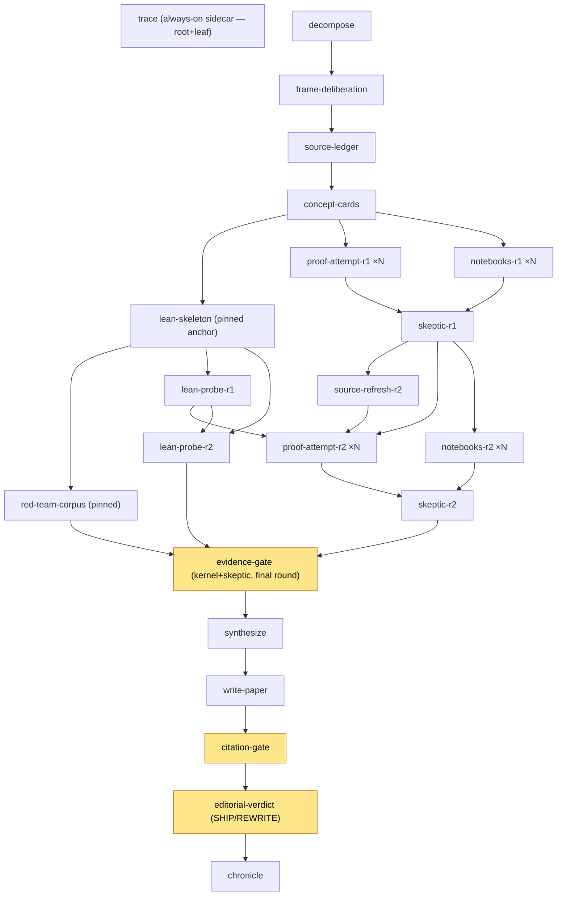

# math-attack v4 — bounded-unroll feedback cycles (DESIGN)

**Status:** design only. No `spore.toml`, `spore.tla`, `spore.cfg`, or README
change ships in this molecule. This note is the blueprint an operator reviews
before authorizing implementation.

**Scope:** add a `rounds` parameter that unrolls the *informal* attack branch
across `1..R` feedback cycles inside the sealed DAG, so a hard conjecture can be
re-attacked automatically (fed the previous round's faults, the still-unproved
list, and freshly-needed sources) without a manual re-germination — while the
graph stays acyclic, the seal keeps holding, and `rounds=1` reproduces v3.x byte
for byte.

---

## 1. Motivation

On a conjecture that defeated a frontier math system, one pass will very likely
not close it. v3.x models a *single* shot: `proof-attempt → skeptic`, one
`lean-probe`, then the gates. Re-cycling today is a **manual re-germination**:
the operator reads `faults.md` and `lean-probe-report.md`, hand-assembles a new
brief (new sources, the completed argument, the revised code), and germinates a
fresh polymer. That human loop is exactly the kind of orchestration the spore is
supposed to *encode*.

v4 turns that loop into data: one integer `rounds`, and the manifest unrolls the
informal branch into `R` cycles wired

```
attempt-1 → skeptic-1 → attempt-2 (fed faults-1 + unproved-1 + missing-sources)
          → skeptic-2 → … → attempt-R → skeptic-R → evidence-gate → …
```

The invariant we must not break: this is a **template**, so the unroll is
*static and bounded* — the operator picks `R` up front, the DAG is fully known
at germination, and the seal certifies the expanded graph. Nothing about the
number of rounds is decided at runtime (see §4.6 on why runtime early-exit is
structurally impossible here).

---

## 2. The structural crux: feedback is *not* a fan-out

The tempting first idea — "fan out `proof-attempt` over `rounds × subquestions`"
— **cannot work**, for two independent reasons, and naming them is the load-
bearing part of this design:

1. **Fan-out instances are parallel and mutually independent by construction.**
   A `for_each` fan-out germinates N siblings that all become runnable together;
   there is no channel for "instance *r* is blocked-by instance *r-1*." Feedback
   is *serial-dependent* (round *r* literally reads round *r-1*'s `faults.md`).
   A fan-out can never express that edge. Feedback must be **statically
   unrolled** as distinct declared node blocks wired `r-1 → r`.

2. **A node already fans out over `subquestions`; the format has one `for_each`
   per node.** Two-dimensional fan-out (`rounds × subquestions`) is not
   expressible today, and per (1) the `rounds` dimension must not be a fan-out
   anyway.

So v4 declares rounds `1..MAXR` **explicitly** in the manifest (with
`MAXR = 3`, the cap), each round's `proof-attempt-rK` / `notebooks-rK` fanning
out over `subquestions` as before, and wires the round-boundary edges by hand.
The `rounds` param then controls **how many** of those declared rounds actually
germinate.

### 2.1 The one primitive v4 needs from cosmon — `active_when`

Gating "germinate round K only if `rounds ≥ K`" collides with a gap in the spore
format. The existing conditional-germination trick (used by `observability`) is
*"fan out over a param list that is empty when off."* But a round's
`proof-attempt-rK` must fan out over `subquestions` (non-empty when active), so
we cannot also overload its `for_each` as the on/off gate — we would need a
*computed* list `subquestions if K ≤ rounds else []`, and param-expression
evaluation does not exist.

The minimal, clean primitive that removes the whole class of problem:

> **`active_when` — a node-level boolean predicate over params.** A `[[spore.node]]`
> carries an optional `active_when = "${params.rounds} >= 2"`; the node (and its
> fan-out, whatever it ranges over) germinates iff the predicate is true at
> expansion. Evaluated from params only, so germination stays a pure function of
> params (the seal's `DeterministicParametrization` is preserved).

This is the empty-list hack promoted to a first-class gate. It is strictly more
expressive (it composes with a real fan-out list, which the hack cannot) and it
reads honestly in the manifest. **This is a missing cosmon-core primitive and
must be surfaced cosmon-ward** (per this repo's "Feeding fixes back to cosmon" —
a missing primitive, not a bench workaround). v4 as designed here *assumes*
`active_when`; without it, the fallback is uglier (the recipient passes
pre-expanded per-round subquestion lists), and that fallback should itself be the
argument for building `active_when`.

Everything below is written against the `active_when` design.

---

## 3. The unrolled DAG

### 3.1 What repeats, what stays pinned

| Node | Per round? | Rationale |
|------|-----------|-----------|
| `proof-attempt` (×`subquestions`) | **yes** — `proof-attempt-rK` | the informal argument is what improves each cycle |
| `notebooks` (×`subquestions`) | **yes** — `notebooks-rK` | recomputes against the revised argument |
| `skeptic` | **yes** — `skeptic-rK` | each round's argument needs its own adversarial pass |
| `lean-probe` | **yes** — `lean-probe-rK` | re-attempts the still-`sorry`'d theorems, fed `unproved-{K-1}` |
| `source-refresh` | **rounds 2..R** — `source-refresh-rK` | a *bounded* delta over the ledger, adding only anchors the prior skeptic flagged missing |
| `lean-skeleton` | **NO — pinned once** | **fidelity anchor.** The statement is fixed before any round runs; re-opening it would let the theorem drift between rounds, which is the exact failure the early fork exists to prevent |
| `red-team-corpus` | **NO — pinned once** | the negative test-suite is a property of the *statement*, not of proof progress; it is anchored to `lean-skeleton` and pins with it |
| `decompose`, `frame-deliberation`, `source-ledger`, `concept-cards` | **NO — pinned once** | the frame and substrate are established once; rounds re-use them (source *growth* goes through `source-refresh`, not a re-frame) |
| `evidence-gate`, `synthesize`, `write-paper`, `citation-gate`, `editorial-verdict`, `chronicle`, `trace` | **NO — pinned once** | the convergence tail runs once, over the **final** round |

The **Lean-branch decision (requirement g)** made explicit:
- `lean-skeleton` — **pinned once**, never re-opened. Statement-drift protection
  is the entire point of the early fork; that guarantee only holds if the anchor
  is immutable across rounds.
- `lean-probe` — **re-attempts every round**, `lean-probe-rK` fed
  `unproved-{K-1}` (the theorems still `UNPROVABLE_IN_BUDGET` after round K-1).
  This is where formal progress accumulates.
- `red-team-corpus` — **pinned once** (default; see open question §7.3).

### 3.2 Round-boundary wiring

Round `K ≥ 2` reads three artifacts from round `K-1`, which is what serializes
the rounds (round K cannot start until round K-1's faults exist):

- `faults-{K-1}` (from `skeptic-r{K-1}`) → the informal corrections, and its
  *missing-sources* section feeds `source-refresh-rK`.
- `unproved-{K-1}` (from `lean-probe-r{K-1}`) → what the kernel still could not
  discharge, fed to both `proof-attempt-rK` and `lean-probe-rK`.
- `source-delta-{K}` (from `source-refresh-rK`) → new anchors for the round.

**Cross-feed direction (default):** formal → informal is on (`proof-attempt-rK`
reads `unproved-{K-1}`); informal → formal is *off* by default (`lean-probe-rK`
reads only its own `unproved-{K-1}`, not the informal `faults`). Rationale: keep
the formal branch's dependence minimal to preserve the fork discipline. See §7.1
— the brief's example arguably wants the symmetric cross-feed, so this is flagged
as an open decision, not a settled one.

### 3.3 DAG sketch (R = 2, single subquestion, observability off)



At `rounds=1`, the entire round-2 block (`sr2, pa2, nb2, sk2, lp2`) is gated off
by `active_when`, and `evidence-gate` reads `skeptic-r1`/`lean-probe-r1` — i.e.
exactly the v3.2 graph (§6).

---

## 4. Seal deltas (TLA+)

The seal continues to certify the same five properties over the *unrolled*
graph. Model at the cap `MAXR = 3` (the richest world); smaller `rounds` remove
trailing round nodes and hold *a fortiori* — the same argument the current
`spore.cfg` already uses for `observability` off.

### 4.1 Node identity gains a round coordinate

```tla
\* MAXR : the rounds cap, a CONSTANT (3 in spore.cfg).
RoundIx == 1..MAXR
\* rnd = 0 marks a round-INDEPENDENT (pinned) node; 0 \notin RoundIx.

Fix(r)   == [role |-> r, sq |-> NULL, rnd |-> 0]
SK(k)    == [role |-> "skeptic",       sq |-> NULL, rnd |-> k]
LP(k)    == [role |-> "lean_probe",    sq |-> NULL, rnd |-> k]
SR(k)    == [role |-> "source_refresh",sq |-> NULL, rnd |-> k]
PA(s,k)  == [role |-> "proof_attempt", sq |-> s,    rnd |-> k]
NB(s,k)  == [role |-> "notebooks",     sq |-> s,    rnd |-> k]

PinnedFixedRoles ==            \* 13 nodes, all rnd = 0
    { "trace","decompose","frame_deliberation","source_ledger","concept_cards",
      "lean_skeleton","red_team_corpus","evidence_gate","synthesize",
      "write_paper","citation_gate","editorial_verdict","chronicle" }

Nodes ==
    { Fix(r) : r \in PinnedFixedRoles }
      \cup { SK(k) : k \in RoundIx } \cup { LP(k) : k \in RoundIx }
      \cup { PA(s,k) : s \in Subquestions, k \in RoundIx }
      \cup { NB(s,k) : s \in Subquestions, k \in RoundIx }
      \cup { SR(k) : k \in (RoundIx \ {1}) }             \* rounds 2..MAXR only
      \cup { [role |-> r, sq |-> o, rnd |-> 0]
             : r \in ObsFanoutRoles, o \in Observability }
```

### 4.2 Dependencies (changed cases only)

```tla
Deps(n) ==
    CASE ...
      [] n.role = "proof_attempt" ->
            IF n.rnd = 1 THEN { Fix("concept_cards") }
            ELSE { Fix("concept_cards"), SK(n.rnd-1), LP(n.rnd-1), SR(n.rnd) }
      [] n.role = "notebooks" ->
            IF n.rnd = 1 THEN { Fix("concept_cards") }
            ELSE { Fix("concept_cards"), SK(n.rnd-1) }
      [] n.role = "skeptic" ->
            { PA(s, n.rnd) : s \in Subquestions }
              \cup { NB(s, n.rnd) : s \in Subquestions }
      [] n.role = "lean_probe" ->
            IF n.rnd = 1 THEN { Fix("lean_skeleton") }
            ELSE { Fix("lean_skeleton"), LP(n.rnd-1) }
      [] n.role = "source_refresh" -> { SK(n.rnd-1) }         \* n.rnd \in 2..MAXR
      [] n.role = "red_team_corpus" -> { Fix("lean_skeleton") }   \* unchanged
      [] n.role = "evidence_gate" ->
            { SK(MAXR), LP(MAXR), Fix("red_team_corpus") }    \* FINAL round
      ...   \* decompose..concept_cards, synthesize..chronicle, obs chain: unchanged
```

Acyclicity: every round-K node depends only on round `≤ K` nodes, and *across*
the round boundary strictly on `K-1`; within a round the sub-structure is the
acyclic v3 shape. So the whole graph is a DAG and **Termination** holds. (The
round serialization is not incidental — it is what §4.7 leans on for
tractability.)

### 4.3 Artifact path — backward-compatible suffixing

```tla
ArtifactPath(n) ==
    LET base == IF n.sq = NULL THEN n.role ELSE n.role \o "-" \o n.sq
    IN  IF n.rnd \in {0, 1} THEN base                 \* pinned or round-1: exact v3 path
        ELSE base \o "-r" \o ToString(n.rnd)          \* round >= 2: suffixed
```

Round-1 and pinned nodes keep their **exact v3 filenames** (backward compat,
§6). A role is either always pinned (`rnd=0`) or always per-round (`rnd≥1`), so
`rnd=0` never clashes with `rnd=1`; round `≥2` is disambiguated by the suffix.
**NoResourceCollision** holds over the extended `(role, sq, rnd)` key.

### 4.4 Produces / Requires — round-scoped keys

Per-round artifact keys carry the round, e.g. `Key("faults", k)`. Changed
entries:

```tla
Produces(SK(k))  == { Key("faults", k) }
Produces(LP(k))  == { Key("lean_probe_report", k), Key("unproved", k) }
Produces(SR(k))  == { Key("source_delta", k) }
Produces(PA(s,k))== { Key("proof_attempt", k) }
Produces(NB(s,k))== { Key("notebooks", k) }

Requires(SR(k))     == { Key("faults", k-1) }                       \* k >= 2
Requires(PA(s,k))   == IF k = 1 THEN { "concept_cards", "source_ledger_md" }
                       ELSE { "concept_cards", "source_ledger_md",
                              Key("faults", k-1), Key("unproved", k-1),
                              Key("source_delta", k) }
Requires(NB(s,k))   == IF k = 1 THEN { "concept_cards" }
                       ELSE { "concept_cards", Key("faults", k-1) }
Requires(SK(k))     == { Key("proof_attempt", k), Key("notebooks", k) }
Requires(LP(k))     == IF k = 1 THEN { "lean_skeleton" }
                       ELSE { "lean_skeleton", Key("unproved", k-1) }
Requires(Fix("evidence_gate")) ==
        { Key("faults", MAXR), Key("lean_probe_report", MAXR), "corpus" }
Requires(Fix("synthesize")) ==
        { "evidence_verdict", Key("proof_attempt", MAXR), Key("notebooks", MAXR),
          Key("faults", MAXR), Key("lean_probe_report", MAXR) }
Requires(Fix("citation_gate")) ==
        { "paper", "source_ledger_md" }
          \cup { Key("source_delta", k) : k \in (RoundIx \ {1}) }   \* refreshed anchors reach the auditor
```

**ArtifactFlow** holds by construction: every round-boundary key
(`faults-{k-1}`, `unproved-{k-1}`, `source-delta-k`) is produced by a *direct*
dependency of the requiring node, hence in `ProducedUpstream`. The
`source-delta-k` keys are transitively upstream of `citation-gate` (through the
final round → synthesize → write-paper chain), so requiring them there is sound.

### 4.5 Gate legs unchanged; they read the final round

`EvidenceDecision`, `CitationDecision`, `EditorialDecision` are **byte-for-byte
unchanged**. The single leg variables (`kernel_leg`, `skeptic_leg`) are now
written by each round's `ExecuteLeanProbe`/`ExecuteSkeptic`; because
`evidence-gate` is `Runnable` only after `SK(MAXR)` and `LP(MAXR)` are `Done`,
the values it folds are the **final round's**. Earlier rounds' writes are
transient and touched no gate. **GateFailClosed** is therefore preserved intact:
an absent final-round skeptic or kernel leg still refuses.

> Modeling note: keep `ExecuteSkeptic(k)` / `ExecuteLeanProbe(k)` as per-round
> actions parameterized by `k`, each with weak fairness, so `Fairness` and hence
> `Termination` extend mechanically.

### 4.6 DeterministicParametrization — the cardinality formula

`rounds` **joins `subquestions` and `observability` as a node-set-altering
param** (the spore.toml comment that lists only those two, and calls `models`/
`profile` posture-only, must be updated). New formula:

```
|Nodes| = 13                     (pinned fixed)
        + 2·R                     (skeptic_k + lean_probe_k)
        + 2·R·|subquestions|      (proof_attempt + notebooks, per round per target)
        + (R − 1)                 (source_refresh_k, rounds 2..R)
        + 3·|observability|
        = 12 + 3R + 2R·|subquestions| + 3·|observability|
```

Sanity: at `R = 1` this is `15 + 2·|subquestions| + 3·|observability|` — the v3.2
formula, exactly (§6).

### 4.7 State-space growth (to be measured at implementation)

v3.2: ~1050 distinct states, depth 23, at 22 nodes (`sq={sq1,sq2}`, `obs={obs1}`).

The reachable states are essentially the *order ideals* (downward-closed
Done-sets) of the DAG poset, times a constant leg-variable factor. The decisive
design fact: **rounds are serialized** (round K blocked-by round K-1), so the
added nodes extend the poset in *depth*, not in parallel *width*. Serial
extension grows the order-ideal count roughly linearly per round, whereas R
independent parallel copies would grow it multiplicatively. Projection (to be
confirmed by an actual TLC run — this molecule does not run TLC):

| MAXR | nodes (sq=2, obs=1) | projected distinct states | projected depth |
|------|--------------------|--------------------------|-----------------|
| 1 | 22 | ~1,050 (measured, v3.2) | 23 |
| 2 | 29 | ~3–5 k | ~34 |
| 3 | 36 | ~7–12 k | ~45 |

All comfortably inside TLC's reach (it handles millions). **The cap `MAXR = 3`
is chosen for cost honesty and human-review load, not for TLC tractability.** An
implementation gate: run TLC at `MAXR = 3` and record the real numbers in
`spore.cfg` before shipping.

### 4.8 `spore.cfg` delta

```tla
CONSTANTS
    Subquestions  = {"sq1", "sq2"}
    Observability = {"obs1"}
    MAXR          = 3            \* NEW — check the richest world; rounds<3 hold a fortiori
    NULL          = NoSq
```

---

## 5. ParamSchema delta

```toml
[spore.params.rounds]
type        = "int"
default     = 1
description = """
Bounded feedback cycles on the informal branch. 1 (default) => single shot,
identical to v3.x. K => proof-attempt/skeptic/lean-probe/notebooks unroll K
times, each round K>=2 fed round K-1's faults + still-unproved list + a bounded
source refresh. Soft cap 3 (state-space + per-round cost); see README cost table.
"""
```

**Cap enforcement is a likely missing primitive.** The current schema (e.g.
`adversarial_corpus_min`, an `int`) carries only `type`/`default`/`description`
— there is no `min`/`max` constraint field. Two honest options:
1. If the format has no numeric bound: enforce `1 ≤ rounds ≤ 3` at
   `cs spore validate` and document the cap in the README. Surface *"ParamSchema
   int has no min/max constraint"* cosmon-ward.
2. If a bound field can be added cheaply, add `max = 3` here and let validate
   reject `rounds=4`.

Either way the seal is modeled at `MAXR = 3`; a `rounds` value above the modeled
cap would germinate an **unsealed** graph and must be refused at validate.

---

## 6. Backward compatibility (`rounds=1` ≡ v3.x)

Checklist, each point verified above:

- **Node set:** cardinality formula at `R=1` = `15 + 2|sq| + 3|obs|`, the v3.2
  formula (§4.6). The round-2+ blocks are `active_when`-gated off.
- **Nodes present:** `proof-attempt-r1 = proof-attempt`, `skeptic-r1 = skeptic`,
  `lean-probe-r1 = lean-probe` (§4.1); no `source-refresh` (rounds 2..R empty).
- **Dependencies:** `evidence-gate` deps `{skeptic-r1, lean-probe-r1,
  red-team-corpus}` = v3.2 `{skeptic, lean-probe, red-team-corpus}` (§4.2).
- **Filenames:** `ArtifactPath` emits no suffix for `rnd ∈ {0,1}` (§4.3), so
  every round-1 artifact keeps its exact v3 name.
- **Gates:** decision functions unchanged; legs read round 1 (§4.5).

`rounds=1` is therefore not "approximately" v3.x — it is the **same DAG, same
paths, same seal state-space**. The v3.2 acceptance report remains valid for the
default.

---

## 7. Open questions (operator decisions before implementation)

1. **Cross-feed symmetry (§3.2).** Default: `lean-probe-rK` reads only its own
   `unproved-{K-1}`, *not* the informal `faults-{K-1}`. The brief's example
   chain arguably wants the vetted informal argument to guide the formalizer.
   Trade-off: guidance (couple probe to skeptic) vs. fork discipline (keep the
   formal branch minimal). **Decision needed.**
2. **`source-refresh` as a node vs. folded into the attempt brief.** Default:
   separate node (auditable `source-delta-k` artifact the citation-gate can see).
   Cheaper alternative: fold the refresh instruction into `proof-attempt-rK`'s
   topic, saving `R-1` nodes but losing the discrete artifact. **Decision needed.**
3. **Does `red-team-corpus` grow per round?** Default: pinned once (it tests the
   *statement*). Alternative: a per-round `corpus-append-rK` leg adding
   near-misses that each round's argument newly suggests. Adds `R-1` nodes and a
   second ArtifactFlow key family. **Default recommended; confirm.**
4. **Does `synthesize` fold the whole trajectory or only round R?** Default:
   verdict rests on round R (ArtifactFlow requires round-R keys only); the prose
   *references* the trajectory (all rounds' artifacts are on disk). Folding all
   rounds into `Requires` is possible but bloats the flow map. **Confirm.**
5. **Fed-forward context cap.** Later rounds accumulate context (all prior
   faults). Default: feed *last* round's faults + *cumulative* unproved. A hard
   conjecture's faults could balloon; consider a cap or a per-round summarizer.
   This is the main driver of the non-flat per-round cost (§8). **Confirm policy.**
6. **`rounds` cap value.** Default 3. Higher caps multiply cost and TLC state
   linearly; the human-review burden on `R` full rounds of proofs is the real
   ceiling. **Confirm 3.**
7. **`active_when` primitive (§2.1).** The whole design assumes it. If cosmon
   will not add it near-term, the fallback (recipient passes pre-expanded
   per-round subquestion lists) is materially uglier and should be weighed
   before committing to v4. **This is the critical-path dependency.**

---

## 8. Cost honesty (README must state this)

Per-round **marginal** node count (`R → R+1`): `3 + 2·|subquestions|` germinated
molecules —
`proof-attempt-rK` (×`sq`, reasoning tier / fable-5),
`notebooks-rK` (×`sq`, build tier / opus-4-8),
`skeptic-rK` (reasoning), `lean-probe-rK` (build), `source-refresh-rK` (build).

Total germinated molecules (observability off):

| rounds | single target (\|sq\|=1) | two targets (\|sq\|=2) |
|-------:|-------------------------:|-----------------------:|
| 1 | 17 | 19 |
| 2 | 22 (+5) | 26 (+7) |
| 3 | 27 (+10) | 33 (+14) |

(`calls = 12 + 3R + 2R·|sq|`, observability off; the always-on `trace` is one of
the 17.)

**The marginal cost is not flat — later rounds are *more* expensive per call.**
Each round's `proof-attempt`/`skeptic` re-reads the accumulating fault and
unproved history, so token cost per call rises with `K` (§7.5). The README's
cost section must say plainly: *"budget super-linearly in `rounds`; a round is
not a fixed unit of spend."* There is still no built-in stop-loss (unchanged from
v3 §9) — `rounds` is the operator's up-front spend dial, and because the DAG is
static there is **no runtime early-exit** even if round 2 already yields a clean
kernel + skeptic verdict (§4.6 / the determinism seal forbids a node set that
depends on runtime verdicts). An operator who wants "stop when proved" must run
`rounds=1`, inspect, and re-germinate — i.e. the very manual loop v4 automates,
now available as a *deliberate* choice rather than the only option.

---

## 9. What this molecule does and does not do

**Does:** deliver this design note.

**Does NOT:** change `spore.toml`, `spore.tla`, `spore.cfg`, `fleet.toml`, the
formulas, or the README; run TLC; or implement `active_when`. Implementation is
gated on operator go (§7) and on the cosmon-ward `active_when` primitive (§2.1).
```
