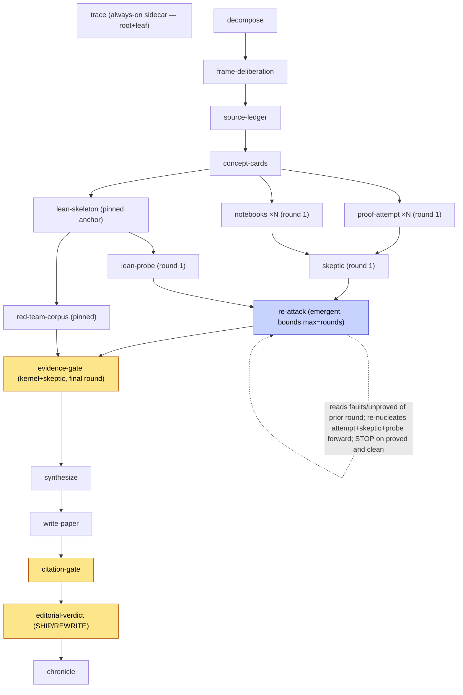

# math-attack v4 — emergent + `[bounds]` loop reuse (DESIGN)

**Status:** design only. No `spore.toml`, `spore.tla`, `spore.cfg`, or README
change ships in this molecule. This note is the blueprint an operator reviews
before authorizing implementation.

**Supersedes:** the earlier *static bounded-unroll* draft of this note (with its
proposed `active_when` primitive). That draft rested on a premise a five-persona
review found unanimously false; §0 records the correction, and the rest of this
note is written against the mechanism that review found already ships.

**Scope:** add a `rounds` parameter so a hard conjecture can be *re-attacked*
automatically — each round fed the previous round's faults, the still-unproved
list, and freshly-needed sources — **without a manual re-germination**. v4
implements this by **reusing a cosmon primitive that already ships**: an
`emergent` node bounded by `[spore.node.bounds]`, composing the `while` loop
formula, exactly as `spores/cosmon-dev/spore.toml` (in the cosmon galaxy) already
does for its double-clean-room convergence. **Zero new spore-format primitives.**
The loop stops the moment the kernel says *proved* and the skeptic is clean —
**runtime early-exit is restored** — or blocks-and-escalates at the `rounds` cap.

---

## 0. The correction that pivots this design

The earlier draft of this note reached for a *static unroll* (name rounds
`1..R` explicitly in the manifest, gate each with a new `active_when` predicate)
because it assumed **a seal cannot cover a dynamic loop.** A deliberation
(godel, turing, torvalds, tolnay, karpathy) examined the actual cosmon source and
found that premise **false**, unanimously:

- **A bounded dynamic loop is already sealed today.** `spores/cosmon-dev/spore.toml`
  declares its `converge` node `kind = "emergent"` with a `[spore.node.bounds]`
  block (`max_instances`, `stop_condition`, `output_type`). Its seal
  (`spores/cosmon-dev/spore.tla`) models that loop as a **bounded round counter**
  `round ∈ 0..MaxRounds` with an injective per-round path `RoundPath(i)`, and
  discharges **Termination, GateFailClosed, DeterministicParametrization,
  NoResourceCollision** over it. The cap is not what forbids a loop from being
  sealed — **the cap is the exact device that makes a dynamic loop sealable**
  (it converts an unbounded foam into a finite, decidable model).
- **`active_when` was solving a problem that does not exist.** The capability it
  offered (bounded, serially-dependent feedback rounds) is precisely what the
  shipped `emergent`+`[bounds]` primitive expresses — with no new format surface.
  `active_when` would have added *a primitive plus a param-expression sublanguage
  the format does not have* (comparison operators, precedence, malformed-predicate
  semantics), a large permanent public-format addition, to gate a single integer,
  and would have arrived at a **strictly worse** outcome: no runtime early-exit.
- Two ways to say "bounded feedback rounds" in one format — a static-unroll
  primitive and the shipped emergent loop — is the cardinal format-minimalism sin:
  one concept, two surfaces, forever.

So v4 pivots. It does **not** invent a mechanism; it **reuses** the one already
proven sealable in a sibling spore.

### 0.1 The gate this pivot rests on — recipient is driver-capable

There is one fact that decides whether reuse is even runnable, and this design is
written on the far side of it having been settled.

`emergent` forward-nucleation (like the `while` loop it composes) needs a
**driver-capable executor**: a local `cs` that carries `wait` and the
`cs run --resident --sweep-every N` loop that absorbs the children a round
nucleates mid-run. The *frozen* `cosmon-remote` pilot surface has no `wait` and
no local resident loop (its `run` is a server-side drain), and could not drive
this loop at all. Under a bare-handed recipient, **neither** the emergent loop
**nor** `while` runs, and static unroll would have been the only shippable
mechanism.

**The operator has confirmed the math-attack recipient runs the full,
driver-capable `cs`.** That verdict is what unlocks this design: with a driver
present, `emergent`+`[bounds]` reuse dominates static unroll on every honest
axis — same seal properties, zero new format surface, *and* it keeps the runtime
early-exit static structurally cannot have. This note is the driver-capable
branch. (The static-unroll blueprint remains the correct fallback **iff** a
future recipient is bare-handed; it is preserved in this file's git history, not
re-derived here.)

---

## 1. Motivation

On a conjecture that defeated a frontier math system, one pass will very likely
not close it. v3.x models a *single* shot: `proof-attempt → skeptic`, one
`lean-probe`, then the gates. Re-cycling today is a **manual re-germination**:
the operator reads `faults.md` and `lean-probe-report.md`, hand-assembles a new
brief (new sources, the completed argument, the revised code), and germinates a
fresh polymer. That human loop is exactly the kind of orchestration the spore is
supposed to *encode*.

v4 turns that loop into data: one integer `rounds`, and a single `emergent`
convergence node re-attacks the conjecture forward, round after round —

```
round 1 (the v3.x informal branch)  → faults-1 + unproved-1
      → re-attack round 2 (fed faults-1 + unproved-1 + a bounded source refresh)
      → faults-2 + unproved-2 → … → STOP when {kernel PROVED ∧ skeptic clean}
                                     OR rounds reached ⇒ blocked + escalate
```

— until the kernel authors a *proved* verdict and the skeptic is clean, or the
`rounds` cap is hit (which **blocks and escalates**, never silently passes).

---

## 2. Why feedback is a loop node, not a fan-out

The tempting first idea — "fan out `proof-attempt` over `rounds × subquestions`"
— cannot work, and it is worth naming why, because it is what pushed the earlier
draft toward static unroll:

- **Fan-out (`for_each`) instances are parallel and mutually independent.** They
  all become runnable together; there is no channel for "round *r* is
  `blocked-by` round *r-1*." Feedback is *serial-dependent* (round *r* reads
  round *r-1*'s `faults.md`). A `for_each` fan-out can never express that edge.

But the earlier draft then wrongly concluded feedback *must* be a statically
declared node block. It skipped the third option, the one that actually ships:

- **`emergent` forward-nucleation is not a fan-out.** It nucleates each round's
  body child at runtime with `cs nucleate --blocked-by <prior-round>` (the
  auto-parent contract), `cs wait`s on it, checks a `stop_condition` at the top
  of the next iteration, and re-nucleates *forward*. Acyclicity holds by
  initialisation (a round only ever depends on an *already-existing* prior
  round). This is exactly how `.cosmon/formulas/while.formula.toml` and
  `spores/cosmon-dev/spore.toml`'s `converge` node express serial round-K→K-1
  dependence — **serial-dependent feedback with zero new format primitives.**

So v4's re-attack is **one `emergent` node bounded by `[bounds]`**, not `R`
declared node blocks.

---

## 3. The design — one param, one node, one formula

### 3.1 What repeats (the emergent loop) and what stays pinned

Round 1 is the existing v3.x informal + formal branches, **unchanged**. A single
new `emergent` node wraps the *re-attack* rounds (2..R). The convergence tail
folds the **final** round.

| Node | Role in v4 |
|------|-----------|
| `decompose`, `frame-deliberation`, `source-ledger`, `concept-cards` | **pinned once** — the frame and substrate are established once; every round re-uses them. |
| `proof-attempt` (×`subquestions`), `notebooks` (×`subquestions`), `skeptic` | **round 1, pinned, byte-identical to v3.x.** This *is* the first attack. |
| `lean-skeleton` | **pinned once, never re-opened.** The fidelity anchor: the theorem statement is fixed before any round runs; re-opening it would let the theorem drift between rounds — the exact failure the early fork exists to prevent. |
| `lean-probe` (round 1), `red-team-corpus` | **pinned.** `red-team-corpus` is a property of the *statement*, not of proof progress; it anchors to `lean-skeleton` and pins with it. |
| **`re-attack` (NEW — `kind = "emergent"`, `[bounds]`)** | **the loop.** `blocked-by {skeptic, lean-probe}`. Each round K≥2 reads round K-1's `faults` + `unproved`, runs a bounded source-refresh, and re-nucleates proof-attempt + skeptic + lean-probe *forward*. Stops on `{kernel PROVED ∧ skeptic clean}` or `rounds` reached. |
| `evidence-gate`, `synthesize`, `write-paper`, `citation-gate`, `editorial-verdict`, `chronicle`, `trace` | **pinned once, over the final round.** `evidence-gate` is `blocked-by re-attack` and folds the loop's final-round kernel + skeptic verdict (or, at `rounds=1`, round 1's directly — see §6). |

The **Lean-branch decision** made explicit:
- `lean-skeleton` — **pinned once**, never re-opened (statement-drift protection).
- `lean-probe` — **re-attempted inside the loop**, fed each round's still-`sorry`'d
  theorems. This is where formal progress accumulates across rounds.
- `red-team-corpus` — **pinned once** (default; see §9).

### 3.2 The one new artifact — a math-specific convergence formula

The only net-new artifact is **one formula** (not a format primitive): a
math-attack convergence body, the analogue of the cosmon galaxy's
`formulas/converge-clean-room.formula.toml`. It **composes**
`.cosmon/formulas/while.formula.toml` (it does not copy it), and per round it:

1. reads round K-1's `faults-{K-1}` (from the prior skeptic) and
   `unproved-{K-1}` (from the prior lean-probe);
2. runs a **bounded source-refresh** — adds only anchors the prior skeptic
   flagged missing (folded into the attempt brief, not a separate node — see
   §8.2);
3. re-nucleates **proof-attempt** (×`subquestions`) + **skeptic** +
   **lean-probe** *forward*, `blocked-by` the prior round;
4. evaluates the `stop_condition` at the top of the next iteration.

Its `stop_condition`, mirroring cosmon-dev's double-clean gate:

> **the kernel returns PROVED (`lake build` green, no `sorry`) AND the skeptic
> returns clean in the same round, OR `rounds` reached ⇒ `blocked` + human
> escalation (never a silent pass).**

Fail-closed throughout: an **absent** `faults` / `unproved` / kernel verdict
blocks like NOT-RUN — it never reads as convergence.

### 3.3 `[bounds]` block and the `rounds` param

```toml
[spore.params.rounds]
type        = "int"
default     = 1
description = """
Bounded feedback cycles on the informal+formal re-attack. 1 (default) => single
shot, identical to v3.x. K => the conjecture is re-attacked up to K times, each
round K>=2 fed round K-1's faults + still-unproved list + a bounded source
refresh, stopping EARLY the moment the kernel proves it and the skeptic is clean.
Soft cap 5 (state-space + per-round cost); see README cost table.
"""

[[spore.node]]
id       = "re-attack"
kind     = "emergent"
for_each = "${nodes.re-attack.rounds}"
formula  = "converge-math-attack"     # NEW formula; composes `while`
# blocked-by {skeptic, lean-probe}; blocks evidence-gate

[spore.node.bounds]
output_type    = "attack-round"
max_instances  = "${params.rounds}"   # the rounds ceiling — the foaming variant the seal bounds
stop_condition = "kernel PROVED (lake build green, no sorry) AND skeptic clean in the same round, OR rounds reached => blocked + human escalation (never a silent pass)"
```

`rounds` **is** `[bounds].max_instances`. There is no new ParamSchema constraint
field and no unsealed-overflow hazard, because **the bound *is* the seal's
Termination variant** — a `rounds` value cannot germinate a graph the seal did
not model, since the seal is modeled over `0..MaxRounds` for the cap `MaxRounds`
the `.cfg` fixes (§4). (`cs spore validate` should still fail-close on
`rounds > MaxRounds` for defence in depth — see §5.)

### 3.4 DAG sketch (rounds = 2, single subquestion, observability off)



At `rounds=1`, `re-attack` foams **zero** re-attack children; `evidence-gate`
folds round 1's `skeptic`/`lean-probe` directly — exactly the v3.2 graph (§6).

---

## 4. Seal — reuse the cosmon-dev pattern, do not re-derive it

The earlier draft spent eight subsections (§4.1–§4.8) re-deriving a bespoke
`(role, sq, rnd)` node-coordinate seal. **All of that is deleted.** The seal
change is to **adopt the pattern `spores/cosmon-dev/spore.tla` already proves**:

### 4.1 The emergent node is one control node + a bounded round counter

Following cosmon-dev's seal verbatim in shape:

```tla
CONSTANT MaxRounds          \* the `rounds` cap; ASSUME MaxRounds \in Nat /\ MaxRounds >= 1
VARIABLE round              \* 0..MaxRounds — the current re-attack round counter
VARIABLE reattack_v         \* "NONE" | "PROVED_CLEAN" | "BLOCKED"  (the loop's folded verdict)
VARIABLE written_rounds     \* SUBSET of RoundPath(i) already written

RoundPath(i) == "attack-round-" \o ToString(i)   \* per-round disjoint artifact path
```

The **node set is param-independent**: `re-attack` is *one* node; its emergent
children are *rounds*, bounded by `MaxRounds`, not extra nodes. This is what
keeps **DeterministicParametrization** intact — `rounds` shapes the loop's
*bound and topics*, not the node set. (Contrast the earlier draft, whose
`|Nodes| = 12 + 3R + 2R·|sq| + 3·|obs|` made the node set grow with `R`; that
whole formula is gone.)

### 4.2 The four properties, discharged as cosmon-dev discharges them

- **Termination** — the gate DAG is acyclic and the re-attack loop is bounded by
  `MaxRounds`; every polymer either drains or `blocks` (escalation) at the cap.
- **GateFailClosed** — `evidence-gate` folds `reattack_v`, which is
  `PROVED_CLEAN` **only** when the kernel is PROVED **and** the skeptic is clean
  in the same round; an absent final-round leg refuses. `citation-gate` and
  `editorial-verdict` decision functions are **byte-for-byte unchanged**.
- **DeterministicParametrization** — node set independent of `rounds` (§4.1).
- **NoResourceCollision** — each round writes `RoundPath(i)`; the round index
  makes round-1 disjoint from round-2 (cosmon-dev's load-bearing detail).

### 4.3 `.cfg` delta

```tla
CONSTANTS
    Subquestions  = {"sq1", "sq2"}
    Observability = {"obs1"}
    MaxRounds     = 5            \* NEW — the modeled cap; smaller `rounds` hold a fortiori
    NULL          = NoSq
```

`MaxRounds` sits beside `Subquestions`/`Observability` as a **posture** for the
model (it bounds the loop counter), **not** as a node-set multiplier. Model at
the cap; smaller `rounds` remove trailing loop rounds and hold *a fortiori* — the
same argument the current `.cfg` already uses for `observability` off, and the
same one cosmon-dev's `.cfg` uses for `MaxRounds`.

### 4.4 State-space (to be measured at implementation)

cosmon-dev's seal already demonstrates a `0..MaxRounds` counter is comfortably
inside TLC's reach. The re-attack counter adds one bounded scalar dimension
(`round`) plus a folded verdict (`reattack_v`) and a `written_rounds` subset —
the exact shape cosmon-dev's TLC run handles. **Implementation gate:** run TLC at
`MaxRounds = 5` and record the real state counts in `.cfg` before shipping (this
molecule does not run TLC).

---

## 5. Fail-closed overflow (defence in depth)

Because `rounds` **is** `[bounds].max_instances` and the seal is modeled over
`0..MaxRounds`, a `rounds` above the modeled cap would let the loop foam past the
sealed bound. `cs spore validate` must **fail-close on `rounds > MaxRounds`** — a
hard refusal, never a README-only cap (the repo's own invariant: *"Simulate the
bare-handed recipient first… refusals are fail-closed"*; *"Verdict before
shipping"*). No new ParamSchema `max` field is added (that is core feature-creep,
the wrong place to grow surface); the check lives at validate, against the `.cfg`
`MaxRounds`.

---

## 6. Backward compatibility (`rounds=1` ≡ v3.x)

- **Round 1 nodes are the v3.x nodes, untouched.** `proof-attempt`, `notebooks`,
  `skeptic`, `lean-skeleton`, `lean-probe`, `red-team-corpus`, and the whole
  frame/substrate and convergence tail are the **exact v3.2 nodes with exact v3.2
  filenames** — v4 adds a node, it does not rewrite the existing ones.
- **At `rounds=1` the `re-attack` node foams zero children** (`max_instances=1`
  ⇒ the loop's bound is the round-1 attempt itself; no forward round is
  nucleated). `evidence-gate` folds round 1's `skeptic`/`lean-probe` directly.
- **Filenames:** round-1 artifacts keep their exact v3 names (they *are* the v3
  nodes); only rounds ≥ 2 carry the `RoundPath(i)` = `attack-round-i` suffix, and
  those exist only when `rounds ≥ 2`.

`rounds=1` is therefore the **same v3.x graph** with one dormant emergent node
that germinates nothing. The v3.2 acceptance report remains valid for the
default. (Honesty note: unlike the earlier static-unroll draft's claim, this is
byte-identical *because the round-1 nodes are literally unchanged*, not because a
suffix rule happens to elide — a cleaner equivalence.)

---

## 7. Runtime early-exit — the headline gain the static draft could not have

The static-unroll draft admitted, as a structural cost, that there is **no
runtime early-exit**: you pay for all `R` rounds even if round 2 already yields a
clean kernel + skeptic verdict, because a determinism seal forbids a node set
that depends on runtime verdicts. **The emergent loop removes that cost.** The
`stop_condition` fires the moment `{kernel PROVED ∧ skeptic clean}` holds, and
the loop drains without nucleating the remaining rounds. "Stop when proved" is
now the *default behaviour*, not a manual re-germination discipline.

For a conjecture that defeated a frontier system, early-exit will fire rarely and
the cap-exhaustion tail is the likely path — so this gain is real but modest for
*this* spore's typical mission. It is still strictly better than paying for all
`R` unconditionally, and it costs nothing to have.

---

## 8. Cost honesty (README must state this)

Per-round **marginal** cost (`rounds → rounds+1`) is the re-nucleated bodies of
one loop round: `proof-attempt` (×`sq`, reasoning tier / fable-5), `notebooks`
(×`sq`, build tier / opus-4-8), `skeptic` (reasoning), `lean-probe` (build), with
the source-refresh folded into the attempt brief (§8.2).

**The marginal cost is not flat — later rounds are *more* expensive per call.**
Each round re-reads the accumulating fault and unproved history, so token cost per
call rises with `K`. The README must say plainly: *"budget super-linearly in
`rounds`; a round is not a fixed unit of spend."* **But** — unlike the static
draft — you do **not** always pay for all `rounds`: the loop early-exits on
`{proved ∧ clean}`. The README's cost table should give the **worst case**
(cap-exhausted, no early-exit) as the budget ceiling, and note early-exit only
*reduces* it.

### 8.1 Context-accumulation cap (open — see §9.5)

Later rounds accumulate context (all prior faults). A hard conjecture's faults
could balloon; the convergence formula should carry a per-round summarizer or a
cap. This is the main driver of the non-flat per-round cost.

### 8.2 Gold-plating cut (torvalds + tolnay convergence)

Deliberately **not** built, to keep v4 minimal:
- `source-refresh` is **folded into the attempt brief**, not a separate node
  (no discrete `source-delta` artifact / key family).
- `red-team-corpus` stays **pinned** (no per-round corpus growth).
- Cross-feed is **minimal** (formal→informal on; informal→formal off).
- `synthesize` folds **only the final round**; the prose *references* the
  trajectory (all rounds' artifacts are on disk).

---

## 9. Open questions (operator decisions before implementation)

1. **Cross-feed symmetry.** Default: the re-attack's `lean-probe` reads only its
   own `unproved-{K-1}`, *not* the informal `faults-{K-1}`. Trade-off: guidance
   (couple probe to skeptic) vs. fork discipline (keep the formal branch minimal).
   **Confirm default.**
2. **`red-team-corpus` growth.** Default: pinned once (it tests the *statement*).
   **Default recommended; confirm.**
3. **`synthesize` scope.** Default: verdict rests on the final round; prose
   references the trajectory. **Confirm.**
4. **`stop_condition` strictness.** Default: `kernel PROVED ∧ skeptic clean` in
   the *same* round. Alternative: allow a "kernel proved, skeptic has only
   cosmetic faults" soft-stop. **Default (strict) recommended; confirm.**
5. **Context-accumulation cap (§8.1).** Feed *last* round's faults + *cumulative*
   unproved, with a per-round summarizer? **Confirm policy.**
6. **`rounds` cap value.** Default 5 (matching cosmon-dev's `max_instances = 5`).
   Higher caps multiply worst-case cost and TLC state; the human-review burden on
   `R` full rounds of proofs is the real ceiling. **Confirm 5** (or lower).

Note what is **no longer** an open question: `active_when` (deleted — reuse
`emergent`), the ParamSchema `min`/`max` field (deleted — the bound is
`[bounds].max_instances`), and the "critical-path cosmon-ward primitive"
dependency (gone — zero new primitives).

---

## 10. Hybrid discipline (dev bench vs. shipped parcel)

Because the recipient is driver-capable (§0.1), the same `emergent` mechanism can
run **both** on the sporarium dev bench and in the shipped parcel — there is no
split-brain to reconcile, unlike the static-shipped / while-dev hybrid the
bare-handed branch would have forced. One caveat still stands: the acceptance
protocol must confirm the recipient's `cs` **actually carries** `wait` +
`cs run --resident` at germination time (the driver-capability the operator
asserted), and **fail closed** if a given recipient turns out bare-handed — in
which case the static-unroll fallback (this file's git history) is the graph to
ship to *that* recipient. The driver-capability assumption is now a
**documented, testable precondition of the parcel**, not a silent one.

---

## 11. What this molecule does and does not do

**Does:** deliver this pivoted design note (and its public issue #1 mirror).

**Does NOT:** change `spore.toml`, `spore.tla`, `spore.cfg`, `fleet.toml`, the
formulas, or the README; run TLC; or write the `converge-math-attack` formula.
Implementation is gated on operator go (§9). The critical-path cosmon-ward
dependency the earlier draft carried (`active_when`) **no longer exists** — v4
now builds entirely on primitives that already ship.
