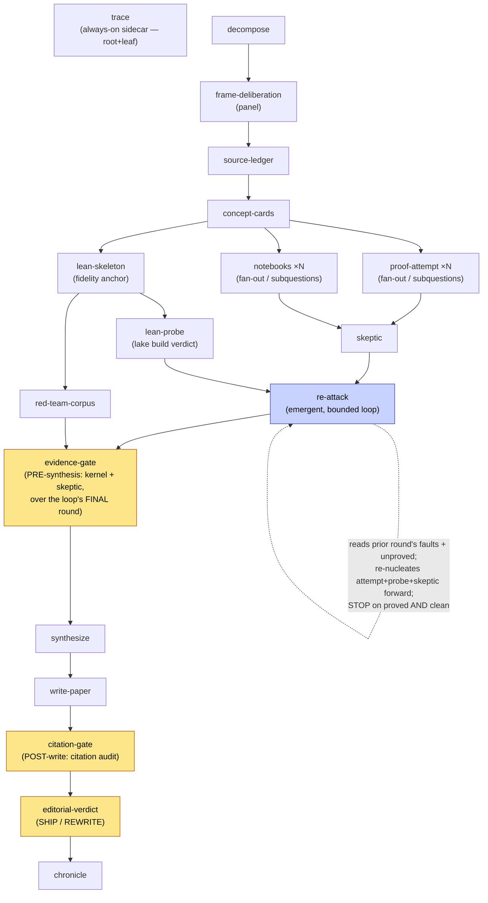
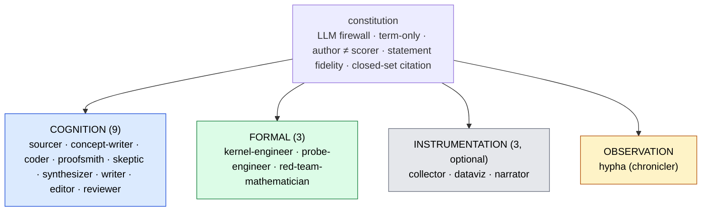

# `math-attack` — a shareable spore for attacking a hard conjecture

A **spore** is a fill-in-the-blanks template of a *whole* cosmon polymer: a
fleet, a set of per-node formulas, a parameter schema, and a DAG of typed
edges. You supply a conjecture, run one command, and cosmon germinates a full
proof/refutation pipeline whose central invariant is simple:

> **No target is ever called *proved* on an LLM's say-so.** A machine kernel
> (Lean's `lake build`) authors the verdict; the LLM only proposes proof terms
> and prose. This is the *LLM firewall*.

**New to cosmon vocabulary** (spore, polymer, molecule, germinate, fleet,
formula, tackle)? Read the [glossary in §14](#14-glossary--cosmon-vocabulary--cs-commands)
first — it defines every house term and every `cs` subcommand this README uses.

**A note on version numbers.** The manifests declare `version = 3` (and
`cs spore validate` prints `(v3)`) — that is the spore-format *manifest* version.
The prose calls this package **v4**: the iteration of the package's *content*
(v3 → v3.1 → v3.2 → v4), independent of the manifest field. Both refer to the
same files you are holding.

**What v4 adds.** One param (`rounds`), one node (`re-attack`), one formula
(`converge-math-attack`) — a bounded **re-attack loop** that re-attacks the
conjecture round after round, each round fed the previous round's faults and
still-unproved list, stopping the moment the kernel proves it and the skeptic is
clean. **Zero new spore-format primitives** (it reuses the shipped
`emergent` + `[spore.node.bounds]` pair). At the default `rounds = 1` the loop
germinates nothing and the graph is **exactly v3.2**. See
[§5bis](#5bis-rounds--the-re-attack-loop-v4).

---

## 0. Status — read this first

> ⚠️ **EXPERIMENTAL — germination-tested, NOT multi-day-run-tested.**
> This package has been proven to *expand, seal, and germinate* correctly
> (verified on the acceptance bench; the full report is available on request via
> an issue at https://github.com/noogram/sporarium/issues).
> It has **not** yet completed a real multi-day conjecture attack in an external
> container. The claim "works out of the zip" is **frozen** until that container
> run passes (see §9).
>
> **v4 specifically:** the seal was re-checked green by TLC (including the
> shipment-gate bound and eight non-vacuity probes — §10), and the manifest
> validates and expands. The re-attack loop has **not** been germinated
> end-to-end at `rounds ≥ 2`; that, plus the driver-capability check on the
> recipient's `cs`, is the acceptance work still owed before any v4 parcel ships.

**Tested environment (what the acceptance run actually exercised):**

| Piece | Tested value |
|-------|--------------|
| OS | macOS 26 (Darwin 25.5.0, arm64) |
| `cs` (validate / germinate) | `cs ≥ 0.2.1` (this run used a development build — see note below) |
| `cs` (TLC seal-verify lane) | a development-branch `cs` build with TLC wired in |
| Java (for TLC) | OpenJDK 26.0.1 (Homebrew) |
| TLC | `tla2tools.jar` — ships in the cosmon repo at `docs/specs/tla2tools.jar` (4.3 MB) |

> **On the `cs` version.** The acceptance run used a development build of `cs`
> (ahead of the published `v0.2.1` at the time of writing). Any `cs ≥ 0.2.1`
> works: `validate` and germination work on any recent `cs`. The development
> build matters only for the TLC seal-verify lane (see
> [§2](#2-what-the-seal-certifies)) — a released `cs` reports `TLC unavailable`
> there and you verify the proof yourself (see [§10](#10-verifying-the-seal-yourself)).

**Untested paths (be honest with yourself before relying on these):**
a real end-to-end attack on a live conjecture; Linux/arm64 in a Docker sandbox;
the pinned models being *reachable* on your account; worker death + recovery
over a multi-day run. These are the subject of the follow-up container gate (§9).

**Seal scope in one line:** the TLC seal proves *abstract, bounded-DAG* gate +
artifact-flow properties. It does **not** prove a worker can start, reach a
model, or produce a non-empty artifact. Full boundary in [§2](#2-what-the-seal-certifies).

**Expected shape / cost:** the **starter lane** (§1) is 4 molecules, one model,
minutes. The **full lane** (§3) is **16 fixed nodes, 18 molecules at the default
fan-out** (one subquestion → the two fan-out nodes germinate one instance each;
more subquestions add two molecules apiece) across three model tiers — budget
accordingly; there is **no built-in cost ceiling** (§9).

**If the first run fails:** the always-on `trace/` sidecar (§8) is your
diagnostic bundle — it records what ran, on what model, producing what bytes,
independently of whether the DAG completed.

---

## 1. Quickstart — the STARTER lane (do this first)

Your first run should be the **starter lane**: 4 nodes, one model
(`claude-opus-4-8`), concurrency 1, no Lean / JVM / Zotero. It gets you one
inspectable, hashed attack trace before you commit to the full lane (16 fixed
nodes, 18 molecules at the default fan-out).

```mermaid
flowchart LR
    clone["git clone sporarium<br/>(the spore = read-only template)"] --> init["mkdir my-attack &amp;&amp; cd my-attack<br/>cs init  (a DEDICATED mission project,<br/>outside the clone)"]
    init --> validate["cs spore validate $SPORE/…<br/>(dry run — germinates nothing)"]
    validate --> lane{"which lane?"}
    lane -->|"start here"| starter["spore-starter.toml<br/>4 nodes, 1 model, no Lean"]
    lane -->|"after inspecting the trace"| full["spore.toml<br/>16 fixed nodes, 3 tiers, Lean branch"]
    starter --> run["cs spore run $SPORE/…<br/>seal: verified (TLC)<br/>or --allow-unchecked-seal"]
    full --> run
    run --> germ["germination<br/>(molecules + blocked-by DAG,<br/>in the mission project)"]
    germ --> drive["cs run --resident --poll-interval 10<br/>(from the mission project)"]
    drive --> artifacts["artifacts + trace/ sidecar"]

    classDef gate fill:#fde68a,stroke:#b45309,color:#000;
    class run gate
```



**Prerequisites:**

- You cloned `github.com/noogram/cosmon` and installed the CLI
  (`cargo install --path crates/cosmon-cli --locked`, which installs to
  `~/.cargo/bin`), so `cs` is on your `PATH`.
  On Linux this build needs the OS packages **`pkg-config`** and
  **`libdbus-1-dev`** (a known cosmon build dependency on Linux); install them
  before `cargo install`.
- Print your versions so a failure is diagnosable:
  `cs --version` and (if you will drive workers) `claude --version`.

**Step 1 — get the spore (a read-only template).**

```sh
git clone https://github.com/noogram/sporarium.git
SPORE="$PWD/sporarium/spores/math-attack"      # remember this path
```

Working from the repo means you can `git pull` fixes and
[open issues](https://github.com/noogram/sporarium/issues) — please do.
A tagged release (e.g. `math-attack-v3.2`) is the immutable alternative:
`git checkout <tag>` pins the exact bytes of a shipped version.

**Step 2 — create a dedicated mission project, OUTSIDE the clone.**

```sh
mkdir firoozbakht-attack && cd firoozbakht-attack
cs init                # creates ./.cosmon/ — this dir is now a cosmon project
```

One mission project per attack. Everything the run produces — the molecules,
the run-scoped output home, the artifacts — lands under this directory's
`.cosmon/state/`. Deleting the directory discards the whole mission and leaves
the spore clone untouched.

There are **two equally valid ways** to point a run at the spore from here;
cosmon has no `install`/`import` verb (only `validate`/`run`/`export`), so
"importing" a spore just means choosing one of these:

- **Reference the clone in place** (used by the commands below): keep the spore
  in the clone and name it by `"$SPORE/…"`. Pro: `git pull` gets author-side
  fixes. This is the default this quickstart shows.
- **Import a copy into your project** (self-contained): `mkdir -p spores && cp -R
  "$SPORE" spores/math-attack`, then run from your project root with
  `cs spore run spores/math-attack/spore.toml …`. Pro: the mission and the exact
  spore bytes travel together; re-copy to pick up fixes. Either way, **run from
  the project root** (see the ADR-161 note below).

> ⚠️ **Two things to get right, or `cs spore run` refuses (cosmon ADR-161).**
> The refusal looks like this, and it is a **refusal, not a crash** — nothing is
> written and no molecule is created:
>
> ```text
> cs: node "decompose" would be handed a forbidden output home
>     …/.cosmon/state/spore-runs/germ-…/decompose (InsideSporeDefinition);
>     refusing to germinate (ADR-161)
> ```
>
> 1. **Run `cs spore run` from your mission project root, not from inside the
>    spore directory.** From the project root, the spore reference works **either
>    way** — a relative path (`spores/math-attack/spore-starter.toml`) or an
>    absolute one both germinate. The refusal fires only when the current
>    directory is **inside the spore's own directory** and you name the spore by a
>    bare relative reference (`spore-starter.toml`): cosmon then resolves the
>    spore-definition boundary around your cwd and refuses, even though the output
>    home is your project's `.cosmon/`. Staying at the project root avoids it
>    entirely. (Verified on `cs 0.2.2`, build 94ba88c.)
> 2. **Never `cs init` inside the spore directory or a copy of it.** That makes
>    the spore's own directory the cosmon project root, so the output home cosmon
>    hands each node genuinely lands inside the spore **definition** tree —
>    writing instances back into the reusable template. This refusal is the
>    invariant working as designed, and no flag overrides it.
>
> `cs spore validate` and `cs spore export` germinate nothing, so neither point
> applies to them: both run fine from anywhere, including inside the spore
> directory.

**Step 3 — validate, then run the starter lane** (from the mission project):

```sh
cs spore validate "$SPORE/spore-starter.toml" \
  --var subject="Firoozbakht's conjecture" \
  --var problem_statement="p(n+1)^(1/(n+1)) < p(n)^(1/n) for all n>=1, to be PROVEN or REFUTED, not assumed"
# => spore: math-attack-starter (v3) - 4 call(s)

cs spore run "$SPORE/spore-starter.toml" \
  --var subject="Firoozbakht's conjecture" \
  --var problem_statement="p(n+1)^(1/(n+1)) < p(n)^(1/n) for all n>=1, to be PROVEN or REFUTED, not assumed" \
  --allow-unchecked-seal
# => run home: <mission>/.cosmon/state/spore-runs/germ-<date>-<hex>
# => Germinated spore math-attack-starter into 4 molecule(s): …
#
# on the released cs (reports "TLC unavailable"): --allow-unchecked-seal germinates
#   the 4 molecules, status "seal: present, NOT verified" (see §2)
# on a development-branch cs: drop the flag; it prints "seal: verified <hash>"
```

Then drive the run — also from the mission project, since that is where the
molecules live:

```sh
cs status                                  # 4 alive
cs run --resident --poll-interval 10
```

The starter DAG is `decompose → proof-attempt → skeptic → trace`. There is **no
kernel leg** here, so it never claims *proved* — it produces a candidate
argument, a skeptical review, and a trace, and says so honestly. Inspect
`trace/` and the three artifacts, then promote to the full lane (§3).

The `profile` param on the full `spore.toml` records this posture (`profile`
defaults to `starter` = "we recommend you start here"). Because a spore param
cannot restructure a fixed-node DAG (a node's kind is fixed at parse time),
the two lanes are **two manifests**, not one switch.

---

## 2. What the seal certifies

This spore declares a `[spore.seal]` block naming **five properties (four
safety invariants + one liveness property, Termination)**.
They are **mechanically checked** by TLC over [`spore.tla`](spore.tla) +
[`spore.cfg`](spore.cfg); `cs spore run` runs that proof before germinating and
prints `seal: verified <hash>` (cached by `BLAKE3(spore.tla ‖ spore.cfg)`).

| Property | What it proves |
|----------|----------------|
| `Termination` | The DAG is acyclic, fan-out is bounded by a param list, and the **re-attack loop is bounded by `rounds`** — so every germinated polymer drains. The cap is not what forbids a dynamic loop from being sealed; it is the exact device that *makes* one sealable (it turns an unbounded foam into a finite, decidable model). |
| `GateFailClosed` | The evidence-gate refuses on an absent kernel/skeptic verdict **and on an unfolded re-attack loop**; the loop folds to `PROVED_CLEAN` **only** when the kernel proved *and* the skeptic was clean in the *same* round; the citation-gate refuses on an absent citation audit; the editorial gate SHIPs only if **both** promoted. No leg silently degrades to "pass". |
| `NoResourceCollision` | No two nodes — **and no two re-attack rounds** — write the same artifact path (the fan-out index keeps `proof-attempt-1` disjoint from `proof-attempt-2`; the round index keeps `attack-round-1/` disjoint from `attack-round-2/`). |
| `DeterministicParametrization` | The node set is a pure function of the params: `|Nodes| = 16 + 2·|subquestions| + 3·|observability|`. **`rounds` does not appear**: `re-attack` is *one* node whose emergent children are rounds, not extra nodes. |
| `ArtifactFlow` *(v3.2)* | Every artifact a node **requires** has an upstream node that **produces** it. |

**What the seal does NOT certify (accepted risk).** The model tracks only
whether a mechanical *verdict is present* and what it says — never proof/prose
**content** (Rice: the truth of a string is undecidable), never LLM agent
semantics, never that a worker can **start**, that a pinned **model is
reachable**, or that a completed node produced a **non-empty artifact**. A green
seal means the *shape* of the attack is sound; it is not a promise that the
attack *ran*. Runtime enforcement of non-empty artifacts is out of scope (§9).

**Fail-closed still holds.** If TLC is *unavailable* (no JRE / `tla2tools.jar`),
`cs spore run` refuses rather than pretend a proof ran — pass
`--allow-unchecked-seal` to opt into the risk (the line stays honest:
`seal: present, NOT verified`). If TLC *rejects* the proof, germination is
refused **unconditionally**; the flag cannot override a failed proof.

> **Note on this build.** A released `cs` (`≥ 0.2.1`) reports `TLC unavailable`
> — the seal-verify wiring is on a development branch, not yet merged into any
> release. The acceptance run verified the seal two ways: directly via TLC
> (`tla2tools.jar`,
> green) and via a development-branch `cs` (`seal: verified`). On a released
> `cs` today, use `--allow-unchecked-seal` and verify the proof yourself with the
> direct command in [§10](#10-verifying-the-seal-yourself).

---

## 3. The full lane — validate → run

Same posture as the starter lane: run these **from your dedicated mission
project** (§1 step 2), naming the spore by path. `$SPORE` is
`…/sporarium/spores/math-attack`.

```sh
cs spore validate "$SPORE/spore.toml" \
  --var subject="Exponential-family stability" \
  --var problem_statement="The natural-parameter MLE map is globally Lipschitz on the mean-parameter polytope, to be PROVEN or REFUTED, not assumed" \
  --var subquestions="interior-strong-convexity,boundary-degeneracy,uniform-Lipschitz-constant" \
  --var formal_backend=lean \
  --var adversarial_corpus_min=15 \
  --var literature_anchors="brown1986exponential,wainwright2008graphical" \
  --var delivery=staged
# => spore: math-attack (v3) - 21 call(s)   (3 proof-attempts || 3 notebooks; observability off)

cs spore run "$SPORE/spore.toml" --var subject="…" --var problem_statement="…" \
  --allow-unchecked-seal
# then drive the whole ensemble to completion (see "Which root?" below):
tmux new -d -s runtime cs run --resident --poll-interval 10
```

**Which root does `cs run` take?** This DAG has **two** roots: `decompose` (the
scientific spine) and `trace` (the always-on sidecar, a root+leaf that depends on
nothing). The legacy `cs run <molecule-id>` mode walks the sub-DAG reachable from
one root — which would leave the *other* root untackled. So drive the **whole
ensemble** with `cs run --resident` (the molecule argument is ignored in resident
mode; both roots drain). To get a specific molecule id if you want the legacy
single-root mode instead, read it from `cs spore run … --json` (one NDJSON line
per germinated molecule) or list them with `cs ensemble`; then
`cs run <decompose-id>` and `cs tackle <trace-id>` separately.

At the single-target default (`subquestions=["main"]`, observability off) the
full lane is **18 calls** (16 fixed + 2 fan-out). `--var list=a,b,c` splits on
commas; `--json` emits one NDJSON line per call.

### The DAG topology (v4, gate split + re-attack loop)



At the default `rounds = 1` the `re-attack` node **germinates nothing**: the
round-1 nodes are the untouched v3.2 nodes with their v3.2 filenames, and the
evidence-gate folds round 1 directly. The graph above is then exactly the v3.2
graph with one dormant node.

The two branches — informal (`proof-attempt` / `notebooks` / `skeptic`) and
formal (`lean-skeleton` / `lean-probe` / `red-team-corpus`) — fork from
`concept-cards` and run **in parallel**. Pinning the Lean statement early (a
fidelity anchor) prevents it drifting while the informal proof is written. The
gates (highlighted) are the fail-closed points.

---

## 4. What artifacts to expect

| Stage | Produces | Role |
|-------|----------|------|
| `trace` *(v3.2)* | `trace/events.jsonl`, `trace/briefs.md`, `trace/hashes.tsv` | **Always-on sidecar** (root+leaf). Raw events + briefs + artifact hashes. Survives a downstream stall. |
| `decompose` | `decompose.md` | Formal restatement, proof-obligation tree, strategies, falsifiability tests. |
| `frame-deliberation` | `outcomes.md` (+ `frame.md`, `responses/`, `synthesis.md`) | Multi-persona panel stress-tests the decomposition before compute. Recommends; never nucleates. |
| `source-ledger` | `source-ledger.md` | Bibliography: citekey + locator + exact statement per source. |
| `concept-cards` | `concept-cards/` | One card per load-bearing definition/lemma, pinned to a ledger row. |
| `proof-attempt` (×N) | `proof-attempt-i.md` | A rigorous prove-or-refute of one target. Never asserts truth. |
| `notebooks` (×N) | `notebook-i` + findings | Computational corroboration/refutation. Never *is* the proof. |
| `skeptic` | `faults.md` | Adversarial review; findings tagged BLOCKER/MAJOR/MINOR. |
| `lean-skeleton` | `lean/` or `skeleton.md` | `theorem … := by sorry` — the fidelity anchor. |
| `lean-probe` | `lean-probe-report.md` | `lake build` verdict: PROVED or UNPROVABLE_IN_BUDGET. |
| `red-team-corpus` | `corpus/` + coverage | ≥ `adversarial_corpus_min` FALSE statements the kernel must reject. |
| `re-attack` *(v4)* | `rounds.md`, `reattack-verdict.json`, `attack-round-K/…` | **Bounded feedback loop.** At `rounds=1`: nothing (dormant). At `rounds≥2`: one `attack-round-K/` per round with its own `proof-attempt-*.md`, `lean-probe-report.md`, `unproved.md`, `faults.md`. The verdict names which round is live. |
| `evidence-gate` *(v3.2)* | `evidence-verdict.md` | **PRE-synthesis** fail-closed gate: kernel + skeptic legs over existing evidence. **No citation audit** (no paper yet). |
| `synthesize` | `synthesis.md` | Proved / refuted / open, at what confidence. |
| `write-paper` | the paper (LaTeX/md) | Attribution: **Noogram**. Every cite traces to a ledger row. |
| `citation-gate` *(v3.2)* | `verification-report.md` | **POST-write** citation audit over the paper (which now exists). Fail-closed. |
| `editorial-verdict` | `editorial-verdict.md` (+ `claims-ledger.md`) | Fail-closed SHIP or REWRITE. Author ≠ scorer. |
| `chronicle` | `docs/lore/CHRONICLES.md` | 0–3 entries, only if a principle was illuminated. |
| `collector` / `dataviz` / `narrator` *(opt)* | `report/…` | **observability=on only.** Read-only charts over the drained DAG. |

### The split gate (v3.2 — the gate-split repair)

Before v3.2 a single `seal-gate` ran the citation audit over "the emerging
paper" — but the paper was produced **downstream** (`write-paper`), so the audit
had nothing to read and failed closed, blocking the very node that would create
the paper. A deterministic deadlock. v3.2 splits it in two, and `ArtifactFlow`
in the seal now makes that class of bug a **seal violation**, not a silent
runtime hang:

- **`evidence-gate`** (pre-synthesis) — gates on the **kernel** leg (`lake build`
  exit 0, grep-clean of `sorry`/`axiom`; DEGRADED honestly if
  `formal_backend=none`) and the **skeptic** leg (`faults.md` has zero residual
  BLOCKERs), over artifacts that already exist. No citation audit here.
- **`citation-gate`** (post-write) — runs the citation audit (the L0–L3
  locator-match tiers, defined just below) over the paper `write-paper`
  produced, against `source-ledger.md`. Zero unresolved L3 / fabricated
  citations to pass.

`editorial-verdict` then SHIPs only if **both** gates promoted.

### The citation tiers (L0–L3)

The citation audit grades every citation by how firmly its **locator** (page /
proposition / theorem number) was matched to the exact statement the paper uses
it to support. Every other file in this package that says "L0/L1/L2/L3" means
these tiers:

| Tier | Meaning |
|------|---------|
| **L0** | A canonical / textbook result: the claim is standard and the precise locator is not load-bearing. |
| **L1** | Primary source, locator **verified** — the cited number really states the claim. (L1 dominates L2: if L1 decides, the lower tiers are moot.) |
| **L2** | Indirect match — `L2_strong` (corroborated by a second source) or `L2_weak` (plausible but the exact locator was not confirmed). |
| **L3** | **Unresolved**: the source could not be located, or the locator does not support the statement (fabrication risk). |

`L3` and `L2_weak` entries require human review; **zero unresolved L3 (and zero
fabricated citations) is required for `citation-gate` to pass.**

---

## 5. Parameters

| Param | Type | Req | Default | Meaning |
|-------|------|-----|---------|---------|
| `subject` | string | **yes** | — | Short name of the conjecture. |
| `problem_statement` | string | **yes** | — | The verbatim conjecture, *"to be PROVEN or REFUTED, not assumed"*. |
| `origin` | string | no | `""` | Provenance / poser / motivation. |
| `subquestions` | list\<string\> | no | `["main"]` | Attack targets. One ⇒ single-target; many ⇒ fan-out. **Never empty.** |
| `formal_backend` | enum `lean\|none` | no | `none` | `lean` ⇒ a real kernel leg gates the evidence-gate; `none` ⇒ Lean branch skipped, kernel leg honestly DEGRADED. |
| `rounds` *(v4)* | int | no | `1` | Bounded re-attack cycles. `1` ⇒ single shot, identical to v3.x. `K` ⇒ up to K re-attacks, each fed the prior round's faults + unproved list, **stopping early** on proved-and-clean. Ceiling **5**. See [§5bis](#5bis-rounds--the-re-attack-loop-v4). |
| `adversarial_corpus_min` | int | no | `10` | Minimum false statements the red-team corpus must author. |
| `literature_anchors` | list\<string\> | no | `["none — build the ledger from scratch"]` | Seed citations for the ledger. |
| `observability` | list\<string\> | no | `[]` | Instrumentation gate. Empty ⇒ off. `--var observability=on` germinates the read-only `collector → dataviz → narrator` chain (+3 nodes). |
| `models` | enum `full\|single` | no | `full` | Model-access posture (advisory) — see [§6](#6-model-access). |
| `profile` | enum `starter\|full` | no | `starter` | Lane posture. `starter` ⇒ run `spore-starter.toml`; `full` ⇒ run this manifest. Advisory (separate manifests). |
| `delivery` | enum `private\|staged\|public` | no | `private` | Delivery posture for the paper. |

Passing an *empty* `subquestions` list is rejected — a fan-out with nothing to
range over is a typo, not an intention.

---

## 5bis. `rounds` — the re-attack loop (v4)

On a conjecture that defeated a frontier system, **one pass will very likely not
close it.** v3.x modelled a single shot: `proof-attempt → skeptic`, one
`lean-probe`, then the gates. Re-cycling meant a *manual* re-germination — you
read `faults.md` and `lean-probe-report.md`, hand-assembled a new brief, and
germinated a fresh polymer. `rounds` turns that human loop into **data**.

```
round 1 (the v3.x attack)  → faults-1 + unproved-1
   → round 2 (fed faults-1 + unproved-1 + only the sources the skeptic flagged missing)
   → faults-2 + unproved-2 → …
   → STOP when {kernel PROVED ∧ skeptic clean}   ⟵ the loop drains, early
   → OR `rounds` reached ⇒ BLOCKED + escalate    ⟵ never a silent pass
```

**What repeats, what stays pinned.** Repeated per round: `proof-attempt` (×
subquestions), `lean-probe`, `skeptic`. Pinned once and **never re-opened**: the
frame and substrate (`decompose` → `frame-deliberation` → `source-ledger` →
`concept-cards`), the **`lean-skeleton` fidelity anchor** (re-opening it would let
the theorem drift *between rounds* — the exact failure the early fork exists to
prevent), and `red-team-corpus` (it tests the *statement*, not proof progress).

**Two numbers, on purpose.** `[spore.node.bounds].max_instances = 5` is the
**structural ceiling** — the foaming bound the seal certifies, fixed for all
runs. `rounds` is the **runtime target** *this* run counts to beneath it, and it
may stop earlier on the stop condition.

**Zero new format primitives.** `re-attack` is `kind = "emergent"` with a
`[spore.node.bounds]` block — the same shipped pair the cosmon-dev spore's
`converge` node already uses and already seals. A `fanout` could not express it:
fan-out instances are parallel and mutually independent, and there is no channel
for *"round K is blocked-by round K−1"*. Feedback is serial-dependent; emergent
forward-nucleation is.

### Cost — budget the worst case

Per-round marginal cost is the re-nucleated bodies of one round: `proof-attempt`
(× subquestions, reasoning tier), `lean-probe` (build tier), `skeptic` (reasoning
tier). The source refresh is folded into the attempt brief, not a separate node.

**A round is not a fixed unit of spend.** Each round re-reads the accumulating
fault and unproved history, so token cost per call **rises with K** — budget
*super-linearly*. The table gives the **worst case** (cap-exhausted, no early
exit) as your ceiling; early exit only ever reduces it.

| `rounds` | Worst-case node executions | Worst-case cost vs. `rounds=1` |
|----------|---------------------------|-------------------------------|
| `1` (default) | the v3.2 graph, unchanged | **1×** (baseline) |
| `2` | + (N attempts + 1 probe + 1 skeptic) | ~2× the attack legs, **> 2×** in tokens |
| `3` | + 2 × (N + 2) | ~3× the attack legs, **> 3×** in tokens |
| `5` (ceiling) | + 4 × (N + 2) | ~5× the attack legs, **≫ 5×** in tokens |

The loop is capped at 5 because the real limit is not compute — it is the
**human review burden** of that many full rounds of proofs.

For a conjecture hard enough to warrant this spore, early exit will fire *rarely*
and the cap-exhaustion tail is the likely path. The gain is real but modest for
the typical mission; it costs nothing to have.

### Preconditions and refusals

- **`rounds ≥ 2` needs a driver-capable `cs`** — one carrying `cs wait` and
  `cs run --resident`, because the loop nucleates children mid-run and waits on
  them. A frozen `cosmon-remote` pilot surface has neither and **cannot drive
  this loop at all**. The convergence formula's `preflight` step checks both
  before anything else and refuses with *"re-germinate with `rounds=1`"* rather
  than half-running. Confirm this at germination time — it is a documented,
  testable precondition of the parcel, not a silent one.
- **`formal_backend = "none"`** means the kernel leg is honestly DEGRADED every
  round, so the strict stop condition (*kernel PROVED*) can **never** fire and the
  loop always runs to the cap. Either budget for that or run `rounds=1`.
- **`rounds > 5` is refused at validate.** The `rounds` runtime target may not
  exceed the sealed structural ceiling `[spore.node.bounds].max_instances = 5`;
  `cs spore validate`/`run` fail closed at expansion with *"var 'rounds' = N
  exceeds its own [bounds] max_instances = 5"* (verified on `cs 0.2.2`, build
  94ba88c — `--var rounds=9` exits non-zero). See [§9](#9-what-is-not-enforced-honest-boundary).

---

## 6. Model access

Each full-lane node runs on a model matched to its cognitive load, carried by a
`model = …` pin on the formula step (the only in-zip channel: a spore node has no
`model` field and the spore→nucleate path drops `--model`).

| Tier | Model | Nodes |
|------|-------|-------|
| **Deep reasoning** | `claude-fable-5` | decompose, frame-deliberation, proof-attempt, skeptic, red-team-corpus, editorial-verdict, re-attack (loop step) |
| **Build / writing** | `claude-opus-4-8` | source-ledger, concept-cards, lean-skeleton, notebooks, lean-probe, synthesize, write-paper |
| **Mechanical / observer** | `claude-sonnet-5` | trace, evidence-gate, chronicle, collector, dataviz, narrator |
| **Citation** | `claude-sonnet-5` | citation-gate |

### The mechanically-effective single-model default is the STARTER lane

The premortem (a pre-mortem review of v3 — "imagine this shipped and failed;
list why") asked for portable single-model execution to be the *mechanically
effective* default. That ask is met by the **starter lane**: every starter node binds
one formula (`task-work-build`, `claude-opus-4-8`), so a recipient with a single
model runs it with **no override at all**. Start there.

### On the full lane, `models=single` is posture + a global override

The pins are **inert until a molecule is tackled** — `validate` and germination
never touch them, so an unavailable model never breaks parsing or germination.
For the full lane, a spore param cannot rewrite a formula file at germination,
so `models=single` is a **posture declaration**, and the effective
override is global:

```sh
ANTHROPIC_MODEL=claude-opus-4-8 cs run --resident --poll-interval 10   # ranks above every pin
# or per molecule:  cs tackle <molecule-id> --model claude-opus-4-8
```

That a param cannot mechanically strip full-lane pins is a **missing spore
primitive**, surfaced back to the cosmon project (not faked here).

### Print the realized model + adapter for every node

To see exactly what each node will run on (the "realized execution
matrix"), read each node's bound formula and its `model` pin, plus its
`crew_role`:

```sh
cs spore validate "$SPORE/spore.toml" --var subject="…" --var problem_statement="…" --json \
| python3 -c '
import sys, json, re, os
# formula paths in the JSON are relative to the SPORE directory, not to the
# mission project you are standing in — resolve them against $SPORE.
spore = os.environ.get("SPORE", ".")
for line in sys.stdin:
    c = json.loads(line)
    f = os.path.join(spore, c["formula"])
    model = "(no pin -> global default / --model)"
    if os.path.exists(f):
        m = re.search(r"(?m)^\s*model\s*=\s*\"([^\"]+)\"", open(f).read())
        if m: model = m.group(1)
    alias = c["alias"]
    role = c["vars"].get("crew_role", "-")
    print("%-20s role=%-22s model=%s" % (alias, role, model))
'
```

---

## 7. The crew fleet (`fleet.toml`) — advanced

`[spore.fleet]` points at a shipped `fleet.toml`: a **research-grade** fleet of
16 agents in four sub-fleets. `cs spore run` reads it straight from the package —
there is no separate install step.

Each sub-fleet is shown by colour (`classDef`), not by a box, to keep the render
clean. The shared constitution (LLM firewall · term-only acceptance · author ≠
scorer · statement fidelity · closed-set citation) governs all four.



### `crew_role` is advisory payload — NOT a proven assignment

Each DAG node names a crew role via a `crew_role` var. **This is descriptive
data that travels in the zip; it is *not* a mechanically verified node→agent
assignment.** The germinated molecule carries the string, and the worker is
*expected* to read the matching briefing from `fleet.toml` — but nothing in the
current spore format *enforces* that a `proofsmith`-tagged molecule is dispatched
to the `proofsmith` agent. Treat the crew map as a routing *intent*, not a proof.

To see each node's realized formula / crew_role / model, use the command in
[§6](#6-model-access). To inspect the flattened crew roster before running:
`cs fleet resolve fleet.toml` (run `cs fleet --help` for the fleet verbs on your
`cs`).

| Node | `crew_role` | Sub-fleet |
|------|-------------|-----------|
| `decompose` / `concept-cards` | concept-writer | cognition |
| `frame-deliberation` | skeptic (panel) | cognition |
| `source-ledger` | sourcer | cognition |
| `proof-attempt` | proofsmith | cognition |
| `notebooks` | coder | cognition |
| `skeptic` | skeptic | cognition |
| `lean-skeleton` / `lean-probe` / `red-team-corpus` | kernel- / probe-engineer / red-team-mathematician | formal |
| `evidence-gate` / `citation-gate` | editor | cognition |
| `synthesize` / `write-paper` / `editorial-verdict` | synthesizer / writer / reviewer | cognition |
| `trace` / `collector` / `dataviz` / `narrator` | collector / dataviz / narrator | instrumentation |
| `chronicle` | hypha | observation |

---

## 8. The always-on trace sidecar (v3.2)

The `trace` node is a **root+leaf**: it has no dependencies (runnable the instant
germination finishes, before any scientific node is tackled) and nothing depends
on it (a stall anywhere downstream never strands it). It is **not** gated by
`observability` and **not** downstream of `chronicle` — that was the trap the
premortem named: the consolation trace scheduled behind the whole
scientific DAG, lost the moment the DAG stalled. `trace/` captures raw events,
each node's brief, and artifact hashes, so even a failed or stalled run leaves an
auditable record of *what ran, on what model, producing what bytes*.

The optional **charts** over that data (`collector → dataviz → narrator`) still
live behind `observability`; only the raw capture is unconditional.

**Honest boundary:** a single node run snapshots once; truly *continuous*
append-only capture during a live run is a cosmon-core sidecar, out of scope this
release (§9).

---

## 9. What is NOT enforced (honest boundary)

The premortem surfaced runtime guarantees this spore does **not** provide. They
are typed separately as cosmon-core work; documented here so you are not
surprised:

- **Non-empty-artifact enforcement.** A worker/adapter *could* emit a
  terminal `completed` state without producing its artifact. The spore declares
  acceptance in prose, but the runtime does not yet refuse completion on an
  absent/empty file. Mitigation: read `trace/hashes.tsv` — a blank hash is a
  failure.
- **Capability preflight.** There is no pre-germination resolver that
  rejects an unreachable model / tool / auth before molecules are created. Pins
  are inert until tackle (§6); an unreachable model fails at tackle, not before.
- **Orphan-recovery bounds.** No documented retry cap or checkpoint-across-
  resurrection guarantee. Drive with `cs run` and watch `cs status`.
- **Cost ceilings.** `concurrency_cap` limits *simultaneous* workers, not
  total tokens / money / wall-time. There is no stop-loss. Budget by hand. With
  `rounds ≥ 2` this matters more, not less — see the [§5bis cost
  table](#cost--budget-the-worst-case).
- **`rounds > max_instances` IS refused at validate** *(v4)*. The `rounds`
  runtime target may not exceed the sealed structural ceiling
  `[spore.node.bounds].max_instances = 5`; a larger value would drive the loop to
  foam past the bound the seal certifies. cosmon fails closed at expansion —
  `cs spore validate`/`run` abort with *"emergent node 're-attack': var 'rounds'
  = N exceeds its own [bounds] max_instances = 5"* and a non-zero exit (verified
  on `cs 0.2.2`, build 94ba88c — `--var rounds=9` refused). Defence in depth: the
  convergence formula's `preflight` step re-checks the bound at runtime before
  nucleating anything. So the ceiling is machine-enforced, not merely
  operator-disciplined.

The **release gate** that would lift the "experimental" label: run this exact
immutable zip + released `cs` for ≥24h in a tester-shaped linux/arm64 container,
including a worker-death drill, an unavailable-model case, and a no-JVM/no-Lean
case, and publish the trace.

---

## 10. Verifying the seal yourself

The seal's five properties are a TLA+ model (`spore.tla`) TLC checks against a
small bounded world (`spore.cfg`). The checker jar (`tla2tools.jar`) ships in the
cosmon repo at `docs/specs/tla2tools.jar` — point `TLA2TOOLS_JAR` at it and run
the proof directly with any Java 11+ on your `PATH`, from inside the spore
directory (`cd "$SPORE"`). This one is pure Java — it germinates nothing, so
the §1 mission-project rule does not apply:

```sh
export TLA2TOOLS_JAR=/path/to/cosmon/docs/specs/tla2tools.jar
java -XX:+UseParallelGC -cp "$TLA2TOOLS_JAR" tlc2.TLC \
    -workers auto -config spore.cfg spore.tla
# => Model checking completed. No error has been found.
#    (1382 distinct states, 4061 generated, depth 27 — measured for v4)
```

The shipped `spore.cfg` models `MaxRounds = 3`: the **smallest** bound that
exercises the loop as a real machine (two non-converged rounds, then exhaustion,
with the clean fixpoint reachable at any round *including round 0* — the
`rounds = 1` dormant world). The shipment-gate bound `MaxRounds = 5` was also run
green (1570 distinct, depth 29): ~94 extra states per round, because the loop adds
**one bounded scalar**, not a topology multiplier. Larger bounds hold *a fortiori*
— the loop variant only grows the cap, never the shape.

Eight loop states were confirmed **reachable** (each by running its negation as an
invariant and observing the violation), so the seal is not vacuously green:
exhaustion, the clean fixpoint, `round = MaxRounds`, the **runtime early exit**
(`PROVED_CLEAN` with `round < MaxRounds`), the dormant `rounds=1` fold
(`PROVED_CLEAN` at `round = 0`), `SHIP` (no v3.2 regression), and both cap
outcomes (DEGRADED under `backend=none`, BLOCKED under `backend=lean`).

The starter lane has its own proof — swap in `spore_starter.cfg` /
`spore_starter.tla`. `ArtifactFlow` and `GateFailClosed` are load-bearing:
injecting the old gate-split bug (a gate that requires a downstream artifact) or a
promote-on-absence gate makes TLC report `Invariant SealInvariant is violated`;
the acceptance bench records both negative tests (report available on request via
an issue at https://github.com/noogram/sporarium/issues).

---

## 11. Deliberation & adversarial review (v3.1, kept)

Before any downstream compute, the **`frame-deliberation`** panel (dispositions
of question-framing *à la* Wheeler, first-principles *à la* Feynman, formal-limits
*à la* Gödel) stress-tests the decomposition and the falsifiability tests. It
**recommends and never nucleates** (a Tier-0 leaf), so it shapes everything
downstream without foaming the DAG. Default `panel=auto` picks the closest
*available* Claude Code subagents (no persona file ships in the zip).

Every gate is scored by a **different molecule and worker** than the one that
authored the artifact: `skeptic` ≠ `proof-attempt`; `evidence-gate` /
`citation-gate` ≠ `synthesize` / `write-paper`; `editorial-verdict`
(`crew_role=reviewer`, the `temp-review` review-as-formula) ≠ `write-paper`
(`crew_role=writer`). The reviewer *scores*; it does not rewrite.

> **Naming note.** The original `temp-review` was literally a
> *backlog-temperature* sweep. We lifted its **discipline** (structured steps +
> fail-closed tabular acceptance + author ≠ scorer) and instantiated it as the
> editorial review, keeping the alias so the binding holds by name.

---

## 12. Files in this template

```
math-attack/
  spore.toml                       the FULL lane (params + DAG + seal + crew ref)
  spore.tla / spore.cfg            the full-lane seal proof + TLC model
  spore-starter.toml               the STARTER lane (4 nodes, one model, no Lean)
  spore_starter.tla / .cfg         the starter-lane seal proof + TLC model
  fleet.toml                       the crew — a research-grade verification fleet (no sentinels)
  README.md                        this file
  formulas/
    task-work.formula.toml            generic agentic base (reference; no node binds it)
    task-work-reasoning.formula.toml  base + claude-fable-5   (proof/skeptic/red-team/decompose)
    task-work-build.formula.toml      base + claude-opus-4-8  (notebooks/lean/ledger/cards/synth; the starter tier)
    task-work-mechanical.formula.toml base + claude-sonnet-5  (trace/evidence-gate/instrumentation)
    deep-think-inline.formula.toml    the frame-deliberation panel (claude-fable-5; lifted)
    editorial-work.formula.toml       write-paper authoring        (claude-opus-4-8; lifted)
    temp-review.formula.toml          editorial-verdict review     (claude-fable-5; review-as-formula)
    citation-audit.formula.toml       the citation-gate leg        (claude-sonnet-5; lifted)
    mycelium.formula.toml             the chronicle fold           (claude-sonnet-5; lifted)
    converge-math-attack.formula.toml the v4 re-attack loop body   (composes the shipped `while`)
```

---

## 13. Export — a content-addressed bundle for sharing

`export` germinates nothing, so (like `validate`) it may be run from anywhere,
including inside the spore directory:

```sh
cs spore export "$SPORE/spore.toml" --out dist/
# => bundle: blake3:…   (stable hash over spore.toml + every referenced formula/seal file)
# => astra:  dist/ro-crate-metadata.json   (a descriptive-metadata sidecar)
```

Same bytes ⇒ same id. Share the hash to pin exactly which version of the attack
someone ran.

*(`astra` is cosmon's label for the second output line; the file it names is an
[RO-Crate](https://www.researchobject.org/ro-crate/) manifest — a standard JSON
description of the bundle's files. Both are informational; the `bundle:` hash is
what pins the version.)*

---

## 14. Glossary — cosmon vocabulary & `cs` commands

**cosmon** is the open-source engine that runs this package: it turns one hard
problem into a DAG of typed, ordered steps, dispatches an AI worker to each, and
records every step so the finished work carries an auditable trace. `cs` is its
command-line tool. You do **not** need to know cosmon internals to run this
spore; the terms below are the minimum.

### The ontology (house terms used in this README)

- **molecule** — one unit of work with a durable identity: a task + its brief +
  its recorded steps, stored on disk under `.cosmon/`. The atom of a cosmon run.
- **formula** — the recipe a molecule follows: an ordered list of steps
  (`implement → verify`, etc.). A formula is to a molecule what a class is to an
  object.
- **nucleate** — create one molecule from a formula (`cs nucleate <formula>`).
- **tackle** — dispatch one AI worker onto one molecule (`cs tackle <id>`).
- **polymer** — a whole DAG of molecules wired by `blocked-by` edges; the
  finished shape of a multi-step mission. (This spore germinates a 16-to-18-node
  polymer, plus up to 4 rounds of re-attack children when `rounds ≥ 2`.)
- **mission** — informal name for a whole germinated polymer, referred to by its
  root molecule id (e.g. `cs deps <mission>` walks that polymer's dependency
  tree). "The mission" and "the polymer" name the same thing from two angles:
  the goal versus its DAG.
- **mission project** — the directory you `cs init` to hold **one** germinated
  mission: its `.cosmon/state/` stores the molecules, the run-scoped output home
  and the artifacts. It is deliberately *not* the spore's own directory (§1
  step 2) — a template must not be written into by its own instances.
- **spore** — a shareable, parameterized *template* of a whole polymer: a fleet
  + per-node formulas + a parameter schema + the DAG + an optional `.tla` seal.
  This package is a spore.
- **germinate** — expand a spore into a live polymer of real molecules
  (`cs spore run`). Germinate is to a spore what nucleate is to a formula.
- **fleet / crew** — the named set of AI agents (roles like `proofsmith`,
  `skeptic`) a polymer runs on, declared in `fleet.toml`.
- **drain / drainage** — a molecule *drains* when it and all its dependencies
  reach a terminal `Done` state; the polymer drains when every node has.
- **foaming** — uncontrolled growth of the DAG (unbounded child nucleation); the
  seal's `Termination` property proves this spore cannot foam.
- **emergent node** *(v4)* — a node that nucleates its own children *at runtime*
  rather than at germination, bounded by a `[spore.node.bounds]` block
  (`max_instances`). That cap is what makes a dynamic loop **sealable**: it turns
  an unbounded foam into a finite, decidable model. The `re-attack` node is this
  spore's only one.
- **forward nucleation** *(v4)* — how a loop stays acyclic: round K is created at
  runtime `blocked-by` round K−1, which already exists. There is never a cycle,
  because a round only ever depends on the past. Germinating round 1 is the
  loop's *initialisation*, not an edge back into it.
- **frontier** — the set of molecules currently ready to run (dependencies met).
- **seal** — a TLA+ model (`spore.tla`) whose safety properties are mechanically
  checked by TLC before germination; see §2 for exactly what it certifies.

### The `cs` subcommands this README uses

| Command | One-line meaning |
|---------|------------------|
| `cs init` | Create a `.cosmon/` project in the current directory — for this spore, the **mission project** you germinate into (§1 step 2). Never run it inside the spore directory. |
| `cs nucleate <formula>` | Create one molecule from a formula (the single-molecule analogue of germination). |
| `cs spore validate <ref>` | Dry-run: parse + expand a spore, print the call list, germinate nothing. |
| `cs spore run <ref>` | Germinate the spore into live molecules (seal-gated). |
| `cs spore export <ref>` | Emit a content-addressed bundle hash + RO-Crate layer. |
| `cs run --resident` | Resident runtime: walk the whole molecule ensemble, tackling ready nodes — **and absorb children nucleated mid-run** (what the v4 re-attack loop needs). |
| `cs wait <id>` | Block until one molecule reaches a terminal state (the v4 loop waits on each round). |
| `cs run <id>` | Legacy mode: walk the sub-DAG reachable from one root molecule. |
| `cs tackle <id>` | Dispatch one worker onto one molecule (no DAG walk). |
| `cs done <id>` | Tear down a finished molecule's worker session (destroys its `.worktrees/<id>/` scratch dir — durable artifacts live under `.cosmon/`, not there). |
| `cs observe <id>` | Print one molecule's live state (with `--json`, its `molecule_dir` and step status). |
| `cs status` | Show the overall run state — which molecules are ready, running, blocked, done. |
| `cs deps <id>` | Print a molecule's dependency tree (`--transitive` walks the whole polymer). |
| `cs ensemble` | List the molecules in the current project and their state. |
| `cs fleet resolve <file>` | Flatten and print a `fleet.toml` crew roster. |
| `cs fleet --help` | Show the fleet verbs available on your `cs`. |
| `cs --version` | Print the `cs` build (include it in any bug report). |

Run `cs <command> --help` for the full, authoritative options of any command;
this table is a reading aid, not the spec.
